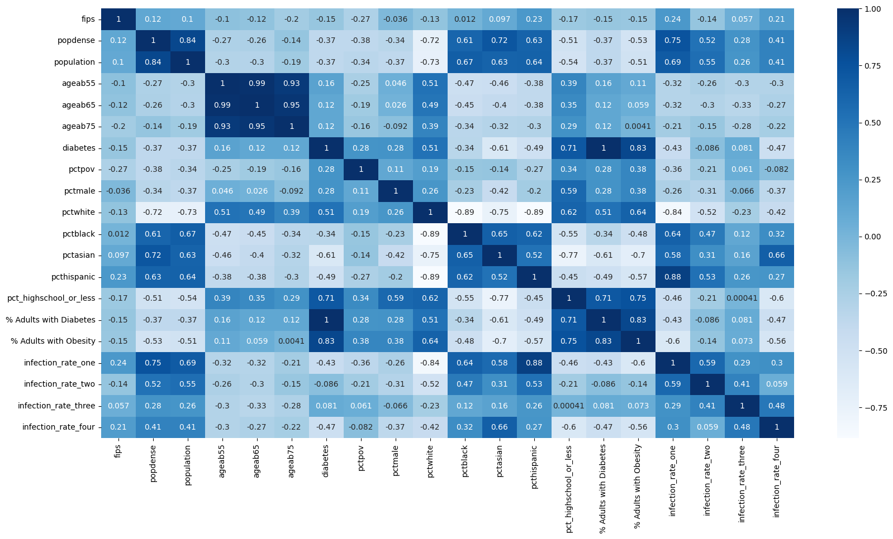
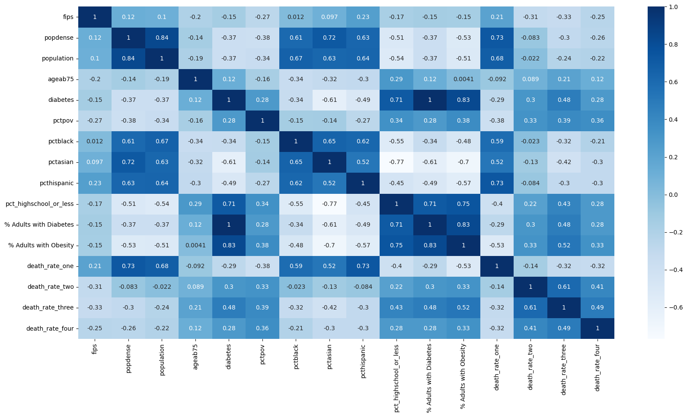
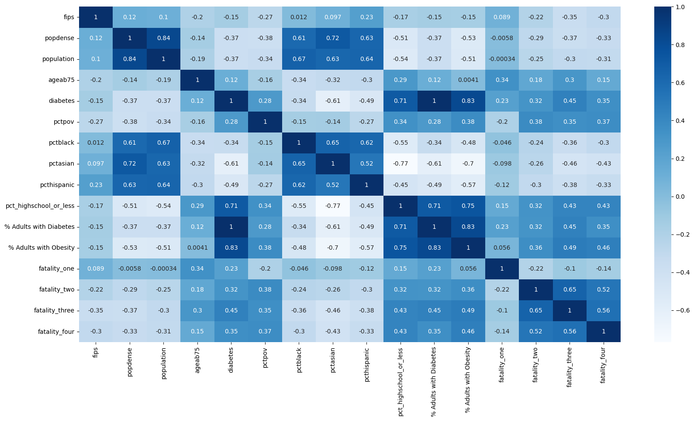
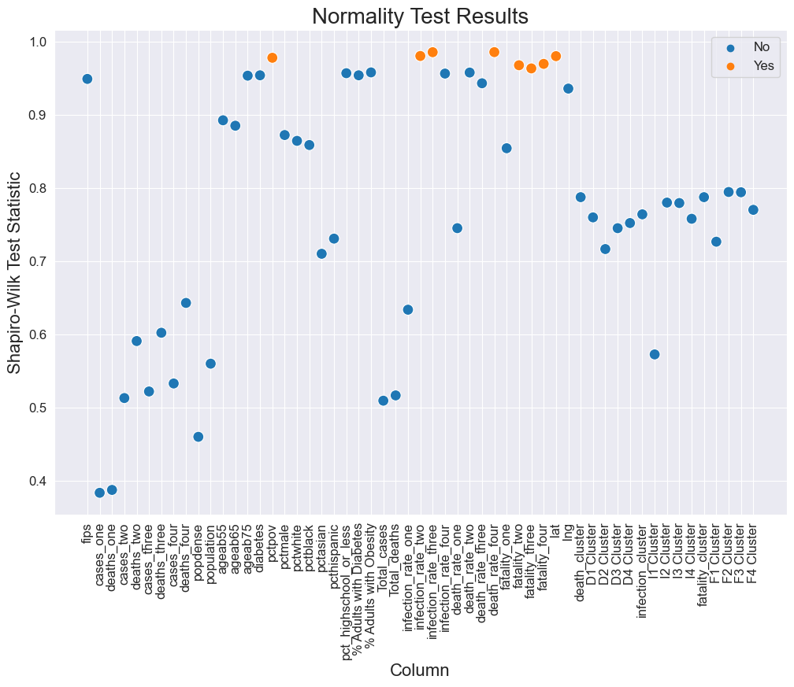

# COVID-19 In NEW YORK State: Effects Of Demographic On Infection, Death And Fatality

## Imports


```python
import pandas as pd
import numpy as np
import matplotlib.pyplot as plt
from sklearn.cluster import KMeans
from sklearn.preprocessing import LabelEncoder, StandardScaler
from sklearn import preprocessing
from sklearn.decomposition import PCA
import random
import seaborn as sns
```

## Data Preprocessing


```python
waveOne = pd.read_csv("Data/covid_wave1_data.csv")
waveTwo = pd.read_csv("Data/covid_wave2_data.csv")
waveThree = pd.read_csv("Data/covid_wave3_data.csv")
waveFour = pd.read_csv("Data/covid_wave4_data.csv")
```


```python
waveOne = waveOne.drop(['Unnamed: 0'], axis=1)
waveOne
```


<div>
<style scoped>
    .dataframe tbody tr th:only-of-type {
        vertical-align: middle;
    }

    .dataframe tbody tr th {
        vertical-align: top;
    }

    .dataframe thead th {
        text-align: right;
    }
</style>
<table border="1" class="dataframe">
  <thead>
    <tr style="text-align: right;">
      <th></th>
      <th>fips</th>
      <th>County Name</th>
      <th>cases</th>
      <th>deaths</th>
    </tr>
  </thead>
  <tbody>
    <tr>
      <th>0</th>
      <td>36001</td>
      <td>Albany County</td>
      <td>2503</td>
      <td>115</td>
    </tr>
    <tr>
      <th>1</th>
      <td>36003</td>
      <td>Allegany County</td>
      <td>74</td>
      <td>2</td>
    </tr>
    <tr>
      <th>2</th>
      <td>36005</td>
      <td>Bronx County</td>
      <td>49573</td>
      <td>4853</td>
    </tr>
    <tr>
      <th>3</th>
      <td>36007</td>
      <td>Broome County</td>
      <td>1037</td>
      <td>72</td>
    </tr>
    <tr>
      <th>4</th>
      <td>36009</td>
      <td>Cattaraugus County</td>
      <td>158</td>
      <td>6</td>
    </tr>
    <tr>
      <th>...</th>
      <td>...</td>
      <td>...</td>
      <td>...</td>
      <td>...</td>
    </tr>
    <tr>
      <th>57</th>
      <td>36115</td>
      <td>Washington County</td>
      <td>254</td>
      <td>14</td>
    </tr>
    <tr>
      <th>58</th>
      <td>36117</td>
      <td>Wayne County</td>
      <td>245</td>
      <td>2</td>
    </tr>
    <tr>
      <th>59</th>
      <td>36119</td>
      <td>Westchester County</td>
      <td>35933</td>
      <td>1445</td>
    </tr>
    <tr>
      <th>60</th>
      <td>36121</td>
      <td>Wyoming County</td>
      <td>112</td>
      <td>4</td>
    </tr>
    <tr>
      <th>61</th>
      <td>36123</td>
      <td>Yates County</td>
      <td>53</td>
      <td>6</td>
    </tr>
  </tbody>
</table>
<p>62 rows × 4 columns</p>
</div>


```python
waveTwo = waveTwo.drop(['Unnamed: 0'], axis=1)
```


```python
waveThree = waveThree.drop(['Unnamed: 0'], axis=1)
```


```python
waveFour = waveFour.drop(['Unnamed: 0'], axis=1)
```


```python
waveOT = pd.merge(waveOne, waveTwo, how="inner", on=["fips", "County Name"])
waveOT = waveOT.rename(columns={"cases_x": "cases_one", "deaths_x": "deaths_one", "cases_y": "cases_two", "deaths_y": "deaths_two"})
waveOT
```


<div>
<style scoped>
    .dataframe tbody tr th:only-of-type {
        vertical-align: middle;
    }

    .dataframe tbody tr th {
        vertical-align: top;
    }

    .dataframe thead th {
        text-align: right;
    }
</style>
<table border="1" class="dataframe">
  <thead>
    <tr style="text-align: right;">
      <th></th>
      <th>fips</th>
      <th>County Name</th>
      <th>cases_one</th>
      <th>deaths_one</th>
      <th>cases_two</th>
      <th>deaths_two</th>
    </tr>
  </thead>
  <tbody>
    <tr>
      <th>0</th>
      <td>36001</td>
      <td>Albany County</td>
      <td>2503</td>
      <td>115</td>
      <td>22231</td>
      <td>242</td>
    </tr>
    <tr>
      <th>1</th>
      <td>36003</td>
      <td>Allegany County</td>
      <td>74</td>
      <td>2</td>
      <td>3488</td>
      <td>85</td>
    </tr>
    <tr>
      <th>2</th>
      <td>36005</td>
      <td>Bronx County</td>
      <td>49573</td>
      <td>4853</td>
      <td>127551</td>
      <td>1716</td>
    </tr>
    <tr>
      <th>3</th>
      <td>36007</td>
      <td>Broome County</td>
      <td>1037</td>
      <td>72</td>
      <td>17618</td>
      <td>294</td>
    </tr>
    <tr>
      <th>4</th>
      <td>36009</td>
      <td>Cattaraugus County</td>
      <td>158</td>
      <td>6</td>
      <td>5566</td>
      <td>86</td>
    </tr>
    <tr>
      <th>...</th>
      <td>...</td>
      <td>...</td>
      <td>...</td>
      <td>...</td>
      <td>...</td>
      <td>...</td>
    </tr>
    <tr>
      <th>57</th>
      <td>36115</td>
      <td>Washington County</td>
      <td>254</td>
      <td>14</td>
      <td>2913</td>
      <td>41</td>
    </tr>
    <tr>
      <th>58</th>
      <td>36117</td>
      <td>Wayne County</td>
      <td>245</td>
      <td>2</td>
      <td>5551</td>
      <td>69</td>
    </tr>
    <tr>
      <th>59</th>
      <td>36119</td>
      <td>Westchester County</td>
      <td>35933</td>
      <td>1445</td>
      <td>93933</td>
      <td>848</td>
    </tr>
    <tr>
      <th>60</th>
      <td>36121</td>
      <td>Wyoming County</td>
      <td>112</td>
      <td>4</td>
      <td>3476</td>
      <td>49</td>
    </tr>
    <tr>
      <th>61</th>
      <td>36123</td>
      <td>Yates County</td>
      <td>53</td>
      <td>6</td>
      <td>1127</td>
      <td>20</td>
    </tr>
  </tbody>
</table>
<p>62 rows × 6 columns</p>
</div>


```python
waveTF = pd.merge(waveThree, waveFour, how="inner", on=["fips", "County Name"])
waveTF = waveTF.rename(columns={"cases_x": "cases_three", "deaths_x": "deaths_three", "cases_y": "cases_four", "deaths_y": "deaths_four"})
waveTF
```


<div>
<style scoped>
    .dataframe tbody tr th:only-of-type {
        vertical-align: middle;
    }

    .dataframe tbody tr th {
        vertical-align: top;
    }

    .dataframe thead th {
        text-align: right;
    }
</style>
<table border="1" class="dataframe">
  <thead>
    <tr style="text-align: right;">
      <th></th>
      <th>fips</th>
      <th>County Name</th>
      <th>cases_three</th>
      <th>deaths_three</th>
      <th>cases_four</th>
      <th>deaths_four</th>
    </tr>
  </thead>
  <tbody>
    <tr>
      <th>0</th>
      <td>36001</td>
      <td>Albany County</td>
      <td>33187</td>
      <td>145</td>
      <td>9624</td>
      <td>40</td>
    </tr>
    <tr>
      <th>1</th>
      <td>36003</td>
      <td>Allegany County</td>
      <td>5233</td>
      <td>62</td>
      <td>830</td>
      <td>7</td>
    </tr>
    <tr>
      <th>2</th>
      <td>36005</td>
      <td>Bronx County</td>
      <td>215504</td>
      <td>1096</td>
      <td>32175</td>
      <td>138</td>
    </tr>
    <tr>
      <th>3</th>
      <td>36007</td>
      <td>Broome County</td>
      <td>25669</td>
      <td>140</td>
      <td>6675</td>
      <td>26</td>
    </tr>
    <tr>
      <th>4</th>
      <td>36009</td>
      <td>Cattaraugus County</td>
      <td>9429</td>
      <td>123</td>
      <td>1714</td>
      <td>11</td>
    </tr>
    <tr>
      <th>...</th>
      <td>...</td>
      <td>...</td>
      <td>...</td>
      <td>...</td>
      <td>...</td>
      <td>...</td>
    </tr>
    <tr>
      <th>57</th>
      <td>36115</td>
      <td>Washington County</td>
      <td>8673</td>
      <td>57</td>
      <td>1757</td>
      <td>8</td>
    </tr>
    <tr>
      <th>58</th>
      <td>36117</td>
      <td>Wayne County</td>
      <td>11087</td>
      <td>96</td>
      <td>2228</td>
      <td>18</td>
    </tr>
    <tr>
      <th>59</th>
      <td>36119</td>
      <td>Westchester County</td>
      <td>116663</td>
      <td>393</td>
      <td>36042</td>
      <td>63</td>
    </tr>
    <tr>
      <th>60</th>
      <td>36121</td>
      <td>Wyoming County</td>
      <td>4630</td>
      <td>29</td>
      <td>787</td>
      <td>3</td>
    </tr>
    <tr>
      <th>61</th>
      <td>36123</td>
      <td>Yates County</td>
      <td>2111</td>
      <td>13</td>
      <td>557</td>
      <td>1</td>
    </tr>
  </tbody>
</table>
<p>62 rows × 6 columns</p>
</div>


```python
waves = pd.merge(waveOT, waveTF, how="inner", on=["fips", "County Name"])
waves
```


<div>
<style scoped>
    .dataframe tbody tr th:only-of-type {
        vertical-align: middle;
    }

    .dataframe tbody tr th {
        vertical-align: top;
    }

    .dataframe thead th {
        text-align: right;
    }
</style>
<table border="1" class="dataframe">
  <thead>
    <tr style="text-align: right;">
      <th></th>
      <th>fips</th>
      <th>County Name</th>
      <th>cases_one</th>
      <th>deaths_one</th>
      <th>cases_two</th>
      <th>deaths_two</th>
      <th>cases_three</th>
      <th>deaths_three</th>
      <th>cases_four</th>
      <th>deaths_four</th>
    </tr>
  </thead>
  <tbody>
    <tr>
      <th>0</th>
      <td>36001</td>
      <td>Albany County</td>
      <td>2503</td>
      <td>115</td>
      <td>22231</td>
      <td>242</td>
      <td>33187</td>
      <td>145</td>
      <td>9624</td>
      <td>40</td>
    </tr>
    <tr>
      <th>1</th>
      <td>36003</td>
      <td>Allegany County</td>
      <td>74</td>
      <td>2</td>
      <td>3488</td>
      <td>85</td>
      <td>5233</td>
      <td>62</td>
      <td>830</td>
      <td>7</td>
    </tr>
    <tr>
      <th>2</th>
      <td>36005</td>
      <td>Bronx County</td>
      <td>49573</td>
      <td>4853</td>
      <td>127551</td>
      <td>1716</td>
      <td>215504</td>
      <td>1096</td>
      <td>32175</td>
      <td>138</td>
    </tr>
    <tr>
      <th>3</th>
      <td>36007</td>
      <td>Broome County</td>
      <td>1037</td>
      <td>72</td>
      <td>17618</td>
      <td>294</td>
      <td>25669</td>
      <td>140</td>
      <td>6675</td>
      <td>26</td>
    </tr>
    <tr>
      <th>4</th>
      <td>36009</td>
      <td>Cattaraugus County</td>
      <td>158</td>
      <td>6</td>
      <td>5566</td>
      <td>86</td>
      <td>9429</td>
      <td>123</td>
      <td>1714</td>
      <td>11</td>
    </tr>
    <tr>
      <th>...</th>
      <td>...</td>
      <td>...</td>
      <td>...</td>
      <td>...</td>
      <td>...</td>
      <td>...</td>
      <td>...</td>
      <td>...</td>
      <td>...</td>
      <td>...</td>
    </tr>
    <tr>
      <th>57</th>
      <td>36115</td>
      <td>Washington County</td>
      <td>254</td>
      <td>14</td>
      <td>2913</td>
      <td>41</td>
      <td>8673</td>
      <td>57</td>
      <td>1757</td>
      <td>8</td>
    </tr>
    <tr>
      <th>58</th>
      <td>36117</td>
      <td>Wayne County</td>
      <td>245</td>
      <td>2</td>
      <td>5551</td>
      <td>69</td>
      <td>11087</td>
      <td>96</td>
      <td>2228</td>
      <td>18</td>
    </tr>
    <tr>
      <th>59</th>
      <td>36119</td>
      <td>Westchester County</td>
      <td>35933</td>
      <td>1445</td>
      <td>93933</td>
      <td>848</td>
      <td>116663</td>
      <td>393</td>
      <td>36042</td>
      <td>63</td>
    </tr>
    <tr>
      <th>60</th>
      <td>36121</td>
      <td>Wyoming County</td>
      <td>112</td>
      <td>4</td>
      <td>3476</td>
      <td>49</td>
      <td>4630</td>
      <td>29</td>
      <td>787</td>
      <td>3</td>
    </tr>
    <tr>
      <th>61</th>
      <td>36123</td>
      <td>Yates County</td>
      <td>53</td>
      <td>6</td>
      <td>1127</td>
      <td>20</td>
      <td>2111</td>
      <td>13</td>
      <td>557</td>
      <td>1</td>
    </tr>
  </tbody>
</table>
<p>62 rows × 10 columns</p>
</div>


```python
demographic = pd.read_csv("Data/county_demographic_data_07042022.csv")
demographic.head()
```


<div>
<style scoped>
    .dataframe tbody tr th:only-of-type {
        vertical-align: middle;
    }

    .dataframe tbody tr th {
        vertical-align: top;
    }

    .dataframe thead th {
        text-align: right;
    }
</style>
<table border="1" class="dataframe">
  <thead>
    <tr style="text-align: right;">
      <th></th>
      <th>Unnamed: 0</th>
      <th>fips</th>
      <th>cases</th>
      <th>deaths</th>
      <th>popdense</th>
      <th>population</th>
      <th>ageab55</th>
      <th>ageab65</th>
      <th>ageab75</th>
      <th>diabetes</th>
      <th>...</th>
      <th>pctindian</th>
      <th>pctasian</th>
      <th>pcthispanic</th>
      <th>AR</th>
      <th>AS</th>
      <th>AT</th>
      <th>AU</th>
      <th>pct_highschool_or_less</th>
      <th>% Adults with Diabetes</th>
      <th>% Adults with Obesity</th>
    </tr>
  </thead>
  <tbody>
    <tr>
      <th>0</th>
      <td>0</td>
      <td>1001</td>
      <td>4190</td>
      <td>48</td>
      <td>36.113876</td>
      <td>55601</td>
      <td>28.447330</td>
      <td>0.155627</td>
      <td>0.067499</td>
      <td>0.11</td>
      <td>...</td>
      <td>0.437042</td>
      <td>1.205014</td>
      <td>2.965774</td>
      <td>11.483395</td>
      <td>33.588459</td>
      <td>28.356571</td>
      <td>26.571573</td>
      <td>45.071854</td>
      <td>11</td>
      <td>33</td>
    </tr>
    <tr>
      <th>1</th>
      <td>1</td>
      <td>1003</td>
      <td>13601</td>
      <td>161</td>
      <td>52.949490</td>
      <td>218022</td>
      <td>34.849694</td>
      <td>0.204433</td>
      <td>0.081794</td>
      <td>0.11</td>
      <td>...</td>
      <td>0.670116</td>
      <td>1.134289</td>
      <td>4.646779</td>
      <td>9.193843</td>
      <td>27.659616</td>
      <td>31.284081</td>
      <td>31.862459</td>
      <td>36.853459</td>
      <td>11</td>
      <td>31</td>
    </tr>
    <tr>
      <th>2</th>
      <td>2</td>
      <td>1005</td>
      <td>1514</td>
      <td>32</td>
      <td>10.854899</td>
      <td>24881</td>
      <td>32.325871</td>
      <td>0.194204</td>
      <td>0.078574</td>
      <td>0.18</td>
      <td>...</td>
      <td>0.341626</td>
      <td>0.454162</td>
      <td>4.276355</td>
      <td>26.786907</td>
      <td>35.604542</td>
      <td>26.029837</td>
      <td>11.578713</td>
      <td>62.391449</td>
      <td>18</td>
      <td>42</td>
    </tr>
    <tr>
      <th>3</th>
      <td>3</td>
      <td>1007</td>
      <td>1834</td>
      <td>46</td>
      <td>13.894338</td>
      <td>22400</td>
      <td>29.406250</td>
      <td>0.164732</td>
      <td>0.067679</td>
      <td>0.15</td>
      <td>...</td>
      <td>0.383929</td>
      <td>0.232143</td>
      <td>2.625000</td>
      <td>20.942602</td>
      <td>44.878773</td>
      <td>23.800098</td>
      <td>10.378526</td>
      <td>65.821375</td>
      <td>15</td>
      <td>38</td>
    </tr>
    <tr>
      <th>4</th>
      <td>4</td>
      <td>1009</td>
      <td>4641</td>
      <td>63</td>
      <td>34.632576</td>
      <td>57840</td>
      <td>31.428077</td>
      <td>0.182365</td>
      <td>0.074429</td>
      <td>0.17</td>
      <td>...</td>
      <td>0.515214</td>
      <td>0.278354</td>
      <td>9.571231</td>
      <td>19.509438</td>
      <td>33.422131</td>
      <td>33.975021</td>
      <td>13.093413</td>
      <td>52.931568</td>
      <td>17</td>
      <td>34</td>
    </tr>
  </tbody>
</table>
<p>5 rows × 27 columns</p>
</div>


```python
demographic = demographic.drop(['Unnamed: 0', 'cases', 'deaths', "AR", "AS", "AT", "AU", "pctindian", "cases rate 10k", "deaths rate 10k", "deaths cases 10k"], axis=1)
```


```python
demographic.head()
```


<div>
<style scoped>
    .dataframe tbody tr th:only-of-type {
        vertical-align: middle;
    }

    .dataframe tbody tr th {
        vertical-align: top;
    }

    .dataframe thead th {
        text-align: right;
    }
</style>
<table border="1" class="dataframe">
  <thead>
    <tr style="text-align: right;">
      <th></th>
      <th>fips</th>
      <th>popdense</th>
      <th>population</th>
      <th>ageab55</th>
      <th>ageab65</th>
      <th>ageab75</th>
      <th>diabetes</th>
      <th>pctpov</th>
      <th>pctmale</th>
      <th>pctwhite</th>
      <th>pctblack</th>
      <th>pctasian</th>
      <th>pcthispanic</th>
      <th>pct_highschool_or_less</th>
      <th>% Adults with Diabetes</th>
      <th>% Adults with Obesity</th>
    </tr>
  </thead>
  <tbody>
    <tr>
      <th>0</th>
      <td>1001</td>
      <td>36.113876</td>
      <td>55601</td>
      <td>28.447330</td>
      <td>0.155627</td>
      <td>0.067499</td>
      <td>0.11</td>
      <td>15.4</td>
      <td>48.551285</td>
      <td>74.308014</td>
      <td>19.343178</td>
      <td>1.205014</td>
      <td>2.965774</td>
      <td>45.071854</td>
      <td>11</td>
      <td>33</td>
    </tr>
    <tr>
      <th>1</th>
      <td>1003</td>
      <td>52.949490</td>
      <td>218022</td>
      <td>34.849694</td>
      <td>0.204433</td>
      <td>0.081794</td>
      <td>0.11</td>
      <td>10.6</td>
      <td>48.461623</td>
      <td>83.111340</td>
      <td>8.783976</td>
      <td>1.134289</td>
      <td>4.646779</td>
      <td>36.853459</td>
      <td>11</td>
      <td>31</td>
    </tr>
    <tr>
      <th>2</th>
      <td>1005</td>
      <td>10.854899</td>
      <td>24881</td>
      <td>32.325871</td>
      <td>0.194204</td>
      <td>0.078574</td>
      <td>0.18</td>
      <td>28.9</td>
      <td>52.783248</td>
      <td>45.641252</td>
      <td>48.032635</td>
      <td>0.454162</td>
      <td>4.276355</td>
      <td>62.391449</td>
      <td>18</td>
      <td>42</td>
    </tr>
    <tr>
      <th>3</th>
      <td>1007</td>
      <td>13.894338</td>
      <td>22400</td>
      <td>29.406250</td>
      <td>0.164732</td>
      <td>0.067679</td>
      <td>0.15</td>
      <td>14.0</td>
      <td>53.218750</td>
      <td>74.589288</td>
      <td>21.120536</td>
      <td>0.232143</td>
      <td>2.625000</td>
      <td>65.821375</td>
      <td>15</td>
      <td>38</td>
    </tr>
    <tr>
      <th>4</th>
      <td>1009</td>
      <td>34.632576</td>
      <td>57840</td>
      <td>31.428077</td>
      <td>0.182365</td>
      <td>0.074429</td>
      <td>0.17</td>
      <td>14.4</td>
      <td>49.273859</td>
      <td>86.886239</td>
      <td>1.462656</td>
      <td>0.278354</td>
      <td>9.571231</td>
      <td>52.931568</td>
      <td>17</td>
      <td>34</td>
    </tr>
  </tbody>
</table>
</div>


```python
wavedemo = pd.merge(waves, demographic, how="left", on=["fips"])
csum_column = wavedemo["cases_one"] + wavedemo["cases_two"] + wavedemo["cases_three"] + wavedemo["cases_four"]
dsum_column = wavedemo["deaths_one"] + wavedemo["deaths_two"] + wavedemo["deaths_three"] + wavedemo["deaths_four"]
wavedemo["Total_cases"] = csum_column
wavedemo["Total_deaths"] = dsum_column
```


```python
wavedemo.head()
```


<div>
<style scoped>
    .dataframe tbody tr th:only-of-type {
        vertical-align: middle;
    }

    .dataframe tbody tr th {
        vertical-align: top;
    }

    .dataframe thead th {
        text-align: right;
    }
</style>
<table border="1" class="dataframe">
  <thead>
    <tr style="text-align: right;">
      <th></th>
      <th>fips</th>
      <th>County Name</th>
      <th>cases_one</th>
      <th>deaths_one</th>
      <th>cases_two</th>
      <th>deaths_two</th>
      <th>cases_three</th>
      <th>deaths_three</th>
      <th>cases_four</th>
      <th>deaths_four</th>
      <th>...</th>
      <th>pctmale</th>
      <th>pctwhite</th>
      <th>pctblack</th>
      <th>pctasian</th>
      <th>pcthispanic</th>
      <th>pct_highschool_or_less</th>
      <th>% Adults with Diabetes</th>
      <th>% Adults with Obesity</th>
      <th>Total_cases</th>
      <th>Total_deaths</th>
    </tr>
  </thead>
  <tbody>
    <tr>
      <th>0</th>
      <td>36001</td>
      <td>Albany County</td>
      <td>2503</td>
      <td>115</td>
      <td>22231</td>
      <td>242</td>
      <td>33187</td>
      <td>145</td>
      <td>9624</td>
      <td>40</td>
      <td>...</td>
      <td>48.428775</td>
      <td>71.807486</td>
      <td>12.793821</td>
      <td>6.720566</td>
      <td>6.100932</td>
      <td>30.816228</td>
      <td>9.0</td>
      <td>27.0</td>
      <td>67545</td>
      <td>542</td>
    </tr>
    <tr>
      <th>1</th>
      <td>36003</td>
      <td>Allegany County</td>
      <td>74</td>
      <td>2</td>
      <td>3488</td>
      <td>85</td>
      <td>5233</td>
      <td>62</td>
      <td>830</td>
      <td>7</td>
      <td>...</td>
      <td>50.762438</td>
      <td>94.294637</td>
      <td>1.277192</td>
      <td>1.277192</td>
      <td>1.677795</td>
      <td>45.881882</td>
      <td>11.0</td>
      <td>36.0</td>
      <td>9625</td>
      <td>156</td>
    </tr>
    <tr>
      <th>2</th>
      <td>36005</td>
      <td>Bronx County</td>
      <td>49573</td>
      <td>4853</td>
      <td>127551</td>
      <td>1716</td>
      <td>215504</td>
      <td>1096</td>
      <td>32175</td>
      <td>138</td>
      <td>...</td>
      <td>NaN</td>
      <td>NaN</td>
      <td>NaN</td>
      <td>NaN</td>
      <td>NaN</td>
      <td>NaN</td>
      <td>NaN</td>
      <td>NaN</td>
      <td>424803</td>
      <td>7803</td>
    </tr>
    <tr>
      <th>3</th>
      <td>36007</td>
      <td>Broome County</td>
      <td>1037</td>
      <td>72</td>
      <td>17618</td>
      <td>294</td>
      <td>25669</td>
      <td>140</td>
      <td>6675</td>
      <td>26</td>
      <td>...</td>
      <td>49.170662</td>
      <td>82.996887</td>
      <td>5.469610</td>
      <td>4.368696</td>
      <td>4.341565</td>
      <td>40.783514</td>
      <td>11.0</td>
      <td>28.0</td>
      <td>50999</td>
      <td>532</td>
    </tr>
    <tr>
      <th>4</th>
      <td>36009</td>
      <td>Cattaraugus County</td>
      <td>158</td>
      <td>6</td>
      <td>5566</td>
      <td>86</td>
      <td>9429</td>
      <td>123</td>
      <td>1714</td>
      <td>11</td>
      <td>...</td>
      <td>49.646018</td>
      <td>90.393025</td>
      <td>1.378189</td>
      <td>0.828995</td>
      <td>2.123894</td>
      <td>50.349108</td>
      <td>13.0</td>
      <td>38.0</td>
      <td>16867</td>
      <td>226</td>
    </tr>
  </tbody>
</table>
<p>5 rows × 27 columns</p>
</div>


```python
wavedemo = wavedemo.dropna(axis=0)
```

#### Encoder Function


```python
def Encoder(df):
          columnsToEncode = list(df.select_dtypes(include=['category','object']))
          le = LabelEncoder()
          for feature in columnsToEncode:
              try:
                  df[feature] = le.fit_transform(df[feature])
              except:
                  print('Error encoding '+feature)
          return df
```


```python
wavedemo.columns
```


    Index(['fips', 'County Name', 'cases_one', 'deaths_one', 'cases_two',
           'deaths_two', 'cases_three', 'deaths_three', 'cases_four',
           'deaths_four', 'popdense', 'population', 'ageab55', 'ageab65',
           'ageab75', 'diabetes', 'pctpov', 'pctmale', 'pctwhite', 'pctblack',
           'pctasian', 'pcthispanic', 'pct_highschool_or_less',
           '% Adults with Diabetes', '% Adults with Obesity', 'Total_cases',
           'Total_deaths'],
          dtype='object')


```python
infection_rate_one = wavedemo["cases_one"]/wavedemo["population"]
infection_rate_two = wavedemo["cases_two"]/wavedemo["population"]
infection_rate_three = wavedemo["cases_three"]/wavedemo["population"]
infection_rate_four = wavedemo["cases_four"]/wavedemo["population"]
death_rate_one = wavedemo["deaths_one"]/wavedemo["population"]
death_rate_two = wavedemo["deaths_two"]/wavedemo["population"]
death_rate_three = wavedemo["deaths_three"]/wavedemo["population"]
death_rate_four = wavedemo["deaths_four"]/wavedemo["population"]
```


```python
wavedemo["infection_rate_one"] = infection_rate_one
wavedemo["infection_rate_two"] = infection_rate_two
wavedemo["infection_rate_three"] = infection_rate_three
wavedemo["infection_rate_four"] = infection_rate_four
wavedemo["death_rate_one"] = death_rate_one
wavedemo["death_rate_two"] = death_rate_two
wavedemo["death_rate_three"] = death_rate_three
wavedemo["death_rate_four"] = death_rate_four
```


```python
fatality_one = wavedemo["deaths_one"]/wavedemo["cases_one"]
fatality_two = wavedemo["deaths_two"]/wavedemo["cases_two"]
fatality_three = wavedemo["deaths_three"]/wavedemo["cases_three"]
fatality_four = wavedemo["deaths_four"]/wavedemo["cases_four"]
```


```python
wavedemo["fatality_one"] = fatality_one
wavedemo["fatality_two"] = fatality_two
wavedemo["fatality_three"] = fatality_three
wavedemo["fatality_four"] = fatality_four
```


```python
wavedemo.dtypes
```


    fips                        int64
    County Name                object
    cases_one                   int64
    deaths_one                  int64
    cases_two                   int64
    deaths_two                  int64
    cases_three                 int64
    deaths_three                int64
    cases_four                  int64
    deaths_four                 int64
    popdense                  float64
    population                float64
    ageab55                   float64
    ageab65                   float64
    ageab75                   float64
    diabetes                  float64
    pctpov                    float64
    pctmale                   float64
    pctwhite                  float64
    pctblack                  float64
    pctasian                  float64
    pcthispanic               float64
    pct_highschool_or_less    float64
    % Adults with Diabetes    float64
    % Adults with Obesity     float64
    Total_cases                 int64
    Total_deaths                int64
    infection_rate_one        float64
    infection_rate_two        float64
    infection_rate_three      float64
    infection_rate_four       float64
    death_rate_one            float64
    death_rate_two            float64
    death_rate_three          float64
    death_rate_four           float64
    fatality_one              float64
    fatality_two              float64
    fatality_three            float64
    fatality_four             float64
    dtype: object


```python
countycoord = pd.read_csv("Data/uscounties.csv")
countycoord = countycoord.rename(columns={"county_fips": "fips"})
countycoord = countycoord.drop(["county"], axis = 1)
countycoord
```


<div>
<style scoped>
    .dataframe tbody tr th:only-of-type {
        vertical-align: middle;
    }

    .dataframe tbody tr th {
        vertical-align: top;
    }

    .dataframe thead th {
        text-align: right;
    }
</style>
<table border="1" class="dataframe">
  <thead>
    <tr style="text-align: right;">
      <th></th>
      <th>fips</th>
      <th>lat</th>
      <th>lng</th>
    </tr>
  </thead>
  <tbody>
    <tr>
      <th>0</th>
      <td>36047</td>
      <td>40.6395</td>
      <td>-73.9385</td>
    </tr>
    <tr>
      <th>1</th>
      <td>36081</td>
      <td>40.7023</td>
      <td>-73.8203</td>
    </tr>
    <tr>
      <th>2</th>
      <td>36061</td>
      <td>40.7785</td>
      <td>-73.9674</td>
    </tr>
    <tr>
      <th>3</th>
      <td>36103</td>
      <td>40.8686</td>
      <td>-72.8448</td>
    </tr>
    <tr>
      <th>4</th>
      <td>36005</td>
      <td>40.8501</td>
      <td>-73.8660</td>
    </tr>
    <tr>
      <th>...</th>
      <td>...</td>
      <td>...</td>
      <td>...</td>
    </tr>
    <tr>
      <th>57</th>
      <td>36011</td>
      <td>42.9175</td>
      <td>-76.5545</td>
    </tr>
    <tr>
      <th>58</th>
      <td>36025</td>
      <td>42.1981</td>
      <td>-74.9665</td>
    </tr>
    <tr>
      <th>59</th>
      <td>36031</td>
      <td>44.1172</td>
      <td>-73.7726</td>
    </tr>
    <tr>
      <th>60</th>
      <td>36123</td>
      <td>42.6335</td>
      <td>-77.1055</td>
    </tr>
    <tr>
      <th>61</th>
      <td>36097</td>
      <td>42.3938</td>
      <td>-76.8752</td>
    </tr>
  </tbody>
</table>
<p>62 rows × 3 columns</p>
</div>


```python
wavedemo = pd.merge(wavedemo, countycoord, how="left", on=["fips"])
```


```python
wavedemo.head()
```


<div>
<style scoped>
    .dataframe tbody tr th:only-of-type {
        vertical-align: middle;
    }

    .dataframe tbody tr th {
        vertical-align: top;
    }

    .dataframe thead th {
        text-align: right;
    }
</style>
<table border="1" class="dataframe">
  <thead>
    <tr style="text-align: right;">
      <th></th>
      <th>fips</th>
      <th>County Name</th>
      <th>cases_one</th>
      <th>deaths_one</th>
      <th>cases_two</th>
      <th>deaths_two</th>
      <th>cases_three</th>
      <th>deaths_three</th>
      <th>cases_four</th>
      <th>deaths_four</th>
      <th>...</th>
      <th>death_rate_one</th>
      <th>death_rate_two</th>
      <th>death_rate_three</th>
      <th>death_rate_four</th>
      <th>fatality_one</th>
      <th>fatality_two</th>
      <th>fatality_three</th>
      <th>fatality_four</th>
      <th>lat</th>
      <th>lng</th>
    </tr>
  </thead>
  <tbody>
    <tr>
      <th>0</th>
      <td>36001</td>
      <td>Albany County</td>
      <td>2503</td>
      <td>115</td>
      <td>22231</td>
      <td>242</td>
      <td>33187</td>
      <td>145</td>
      <td>9624</td>
      <td>40</td>
      <td>...</td>
      <td>0.000374</td>
      <td>0.000788</td>
      <td>0.000472</td>
      <td>0.000130</td>
      <td>0.045945</td>
      <td>0.010886</td>
      <td>0.004369</td>
      <td>0.004156</td>
      <td>42.6002</td>
      <td>-73.9736</td>
    </tr>
    <tr>
      <th>1</th>
      <td>36003</td>
      <td>Allegany County</td>
      <td>74</td>
      <td>2</td>
      <td>3488</td>
      <td>85</td>
      <td>5233</td>
      <td>62</td>
      <td>830</td>
      <td>7</td>
      <td>...</td>
      <td>0.000043</td>
      <td>0.001831</td>
      <td>0.001335</td>
      <td>0.000151</td>
      <td>0.027027</td>
      <td>0.024369</td>
      <td>0.011848</td>
      <td>0.008434</td>
      <td>42.2574</td>
      <td>-78.0276</td>
    </tr>
    <tr>
      <th>2</th>
      <td>36007</td>
      <td>Broome County</td>
      <td>1037</td>
      <td>72</td>
      <td>17618</td>
      <td>294</td>
      <td>25669</td>
      <td>140</td>
      <td>6675</td>
      <td>26</td>
      <td>...</td>
      <td>0.000376</td>
      <td>0.001534</td>
      <td>0.000730</td>
      <td>0.000136</td>
      <td>0.069431</td>
      <td>0.016687</td>
      <td>0.005454</td>
      <td>0.003895</td>
      <td>42.1602</td>
      <td>-75.8196</td>
    </tr>
    <tr>
      <th>3</th>
      <td>36009</td>
      <td>Cattaraugus County</td>
      <td>158</td>
      <td>6</td>
      <td>5566</td>
      <td>86</td>
      <td>9429</td>
      <td>123</td>
      <td>1714</td>
      <td>11</td>
      <td>...</td>
      <td>0.000078</td>
      <td>0.001119</td>
      <td>0.001601</td>
      <td>0.000143</td>
      <td>0.037975</td>
      <td>0.015451</td>
      <td>0.013045</td>
      <td>0.006418</td>
      <td>42.2486</td>
      <td>-78.6788</td>
    </tr>
    <tr>
      <th>4</th>
      <td>36011</td>
      <td>Cayuga County</td>
      <td>143</td>
      <td>2</td>
      <td>6207</td>
      <td>90</td>
      <td>9267</td>
      <td>51</td>
      <td>2209</td>
      <td>17</td>
      <td>...</td>
      <td>0.000026</td>
      <td>0.001167</td>
      <td>0.000661</td>
      <td>0.000220</td>
      <td>0.013986</td>
      <td>0.014500</td>
      <td>0.005503</td>
      <td>0.007696</td>
      <td>42.9175</td>
      <td>-76.5545</td>
    </tr>
  </tbody>
</table>
<p>5 rows × 41 columns</p>
</div>


```python

```

## Clustering


```python
death = wavedemo[['death_rate_one', 'death_rate_two', 'death_rate_three', 'death_rate_four']]
infection = wavedemo[['infection_rate_one', 'infection_rate_two', 'infection_rate_three', 'infection_rate_four']]
fatality = wavedemo[['fatality_one', 'fatality_two', 'fatality_three', 'fatality_four']]
```


```python
deathdf = Encoder(death)
deathData = StandardScaler()
deathdf = deathData.fit_transform(deathdf)
```


```python
infectiondf = Encoder(infection)
infectionData = StandardScaler()
infectiondf = infectionData.fit_transform(infectiondf)
```


```python
fatalitydf = Encoder(death)
fatalitydata = StandardScaler()
fatalitydf = fatalitydata.fit_transform(fatalitydf)
```


```python
# Select the 'death_rate_one' column and convert it to a numpy array
X = np.array(wavedemo['death_rate_one']).reshape(-1, 1)

# Define the number of clusters
k = 3

# Create a KMeans instance with the desired number of clusters and fit the data
kmeans = KMeans(n_clusters=k, random_state=42).fit(X)

# Get the cluster labels and centroids
labels = kmeans.labels_
centroids = kmeans.cluster_centers_

# Add the cluster labels to the original dataframe
wavedemo['D1 Cluster'] = labels

# Print the results
#for i in range(k):
 #   print('Cluster ', i+1)
  #  print(wavedemo[wavedemo['D1 Cluster'] == i]['County Name'])
   # print('Centroid: ', centroids[i][0])
    #print('\n')
```


```python
# Select the 'death_rate_one' column and convert it to a numpy array
X = np.array(wavedemo['death_rate_two']).reshape(-1, 1)

# Define the number of clusters
k = 3

# Create a KMeans instance with the desired number of clusters and fit the data
kmeans = KMeans(n_clusters=k, random_state=42).fit(X)

# Get the cluster labels and centroids
labels = kmeans.labels_
centroids = kmeans.cluster_centers_

# Add the cluster labels to the original dataframe
wavedemo['D2 Cluster'] = labels
```


```python
# Select the 'death_rate_one' column and convert it to a numpy array
X = np.array(wavedemo['death_rate_three']).reshape(-1, 1)

# Define the number of clusters
k = 3

# Create a KMeans instance with the desired number of clusters and fit the data
kmeans = KMeans(n_clusters=k, random_state=42).fit(X)

# Get the cluster labels and centroids
labels = kmeans.labels_
centroids = kmeans.cluster_centers_

# Add the cluster labels to the original dataframe
wavedemo['D3 Cluster'] = labels
```


```python
# Select the 'death_rate_one' column and convert it to a numpy array
X = np.array(wavedemo['death_rate_four']).reshape(-1, 1)

# Define the number of clusters
k = 3

# Create a KMeans instance with the desired number of clusters and fit the data
kmeans = KMeans(n_clusters=k, random_state=42).fit(X)

# Get the cluster labels and centroids
labels = kmeans.labels_
centroids = kmeans.cluster_centers_

# Add the cluster labels to the original dataframe
wavedemo['D4 Cluster'] = labels
```


```python
# Perform K-means clustering with k=3 clusters
deathmeans = KMeans(n_clusters=3, random_state=42)
kmeans.fit(deathdf)

# Add the cluster labels to the original dataframe
wavedemo['death_cluster'] = kmeans.labels_

# Print out the cluster centers
centers = deathData.inverse_transform(kmeans.cluster_centers_)
print(centers)
```

    [[1.23186518e-03 7.60853273e-04 5.08418127e-04 8.90516091e-05]
     [1.86545245e-04 7.72385525e-04 6.33603845e-04 1.25629887e-04]
     [2.04460461e-04 1.49136219e-03 1.07943805e-03 1.70768117e-04]]
    


```python

```


```python
# Select the 'death_rate_one' column and convert it to a numpy array
X = np.array(wavedemo['infection_rate_one']).reshape(-1, 1)

# Define the number of clusters
k = 3

# Create a KMeans instance with the desired number of clusters and fit the data
kmeans = KMeans(n_clusters=k, random_state=42).fit(X)

# Get the cluster labels and centroids
labels = kmeans.labels_
centroids = kmeans.cluster_centers_

# Add the cluster labels to the original dataframe
wavedemo['I1 Cluster'] = labels
```


```python
# Select the 'death_rate_one' column and convert it to a numpy array
X = np.array(wavedemo['infection_rate_two']).reshape(-1, 1)

# Define the number of clusters
k = 3

# Create a KMeans instance with the desired number of clusters and fit the data
kmeans = KMeans(n_clusters=k, random_state=42).fit(X)

# Get the cluster labels and centroids
labels = kmeans.labels_
centroids = kmeans.cluster_centers_

# Add the cluster labels to the original dataframe
wavedemo['I2 Cluster'] = labels
```


```python
# Select the 'death_rate_one' column and convert it to a numpy array
X = np.array(wavedemo['infection_rate_three']).reshape(-1, 1)

# Define the number of clusters
k = 3

# Create a KMeans instance with the desired number of clusters and fit the data
kmeans = KMeans(n_clusters=k, random_state=42).fit(X)

# Get the cluster labels and centroids
labels = kmeans.labels_
centroids = kmeans.cluster_centers_

# Add the cluster labels to the original dataframe
wavedemo['I3 Cluster'] = labels
```


```python
# Select the 'death_rate_one' column and convert it to a numpy array
X = np.array(wavedemo['infection_rate_four']).reshape(-1, 1)

# Define the number of clusters
k = 3

# Create a KMeans instance with the desired number of clusters and fit the data
kmeans = KMeans(n_clusters=k, random_state=42).fit(X)

# Get the cluster labels and centroids
labels = kmeans.labels_
centroids = kmeans.cluster_centers_

# Add the cluster labels to the original dataframe
wavedemo['I4 Cluster'] = labels
```


```python
# Perform K-means clustering with k=3 clusters
infectionmeans = KMeans(n_clusters=3, random_state=42)
kmeans.fit(infectiondf)

# Add the cluster labels to the original dataframe
wavedemo['infection_cluster'] = kmeans.labels_

# Print out the cluster centers
centers = infectionData.inverse_transform(kmeans.cluster_centers_)
print(centers)
```

    [[0.03394138 0.10141774 0.14242088 0.03483026]
     [0.00388179 0.06597009 0.11320081 0.02525579]
     [0.00558142 0.07451966 0.13708681 0.03346418]]
    


```python

```


```python
# Select the 'death_rate_one' column and convert it to a numpy array
X = np.array(wavedemo['fatality_one']).reshape(-1, 1)

# Define the number of clusters
k = 3

# Create a KMeans instance with the desired number of clusters and fit the data
kmeans = KMeans(n_clusters=k, random_state=42).fit(X)

# Get the cluster labels and centroids
labels = kmeans.labels_
centroids = kmeans.cluster_centers_

# Add the cluster labels to the original dataframe
wavedemo['F1 Cluster'] = labels
```


```python
# Select the 'death_rate_one' column and convert it to a numpy array
X = np.array(wavedemo['fatality_two']).reshape(-1, 1)

# Define the number of clusters
k = 3

# Create a KMeans instance with the desired number of clusters and fit the data
kmeans = KMeans(n_clusters=k, random_state=42).fit(X)

# Get the cluster labels and centroids
labels = kmeans.labels_
centroids = kmeans.cluster_centers_

# Add the cluster labels to the original dataframe
wavedemo['F2 Cluster'] = labels
```


```python
# Select the 'death_rate_one' column and convert it to a numpy array
X = np.array(wavedemo['fatality_three']).reshape(-1, 1)

# Define the number of clusters
k = 3

# Create a KMeans instance with the desired number of clusters and fit the data
kmeans = KMeans(n_clusters=k, random_state=42).fit(X)

# Get the cluster labels and centroids
labels = kmeans.labels_
centroids = kmeans.cluster_centers_

# Add the cluster labels to the original dataframe
wavedemo['F3 Cluster'] = labels
```


```python
# Select the 'death_rate_one' column and convert it to a numpy array
X = np.array(wavedemo['fatality_four']).reshape(-1, 1)

# Define the number of clusters
k = 3

# Create a KMeans instance with the desired number of clusters and fit the data
kmeans = KMeans(n_clusters=k, random_state=42).fit(X)

# Get the cluster labels and centroids
labels = kmeans.labels_
centroids = kmeans.cluster_centers_

# Add the cluster labels to the original dataframe
wavedemo['F4 Cluster'] = labels
```


```python
# Perform K-means clustering with k=3 clusters
fatalitymeans = KMeans(n_clusters=3, random_state=42)
kmeans.fit(fatalitydf)

# Add the cluster labels to the original dataframe
wavedemo['fatality_cluster'] = kmeans.labels_

# Print out the cluster centers
centers = fatalitydata.inverse_transform(kmeans.cluster_centers_)
print(centers)
```

    [[1.23186518e-03 7.60853273e-04 5.08418127e-04 8.90516091e-05]
     [1.86545245e-04 7.72385525e-04 6.33603845e-04 1.25629887e-04]
     [2.04460461e-04 1.49136219e-03 1.07943805e-03 1.70768117e-04]]
    


```python

```

## Correlation


```python
idf= wavedemo[['fips', 'popdense', 'population', 'ageab55', 'ageab65',
       'ageab75', 'diabetes', 'pctpov', 'pctmale', 'pctwhite', 'pctblack',
       'pctasian', 'pcthispanic', 'pct_highschool_or_less',
       '% Adults with Diabetes', '% Adults with Obesity', 'infection_rate_one', 'infection_rate_two',
       'infection_rate_three', 'infection_rate_four']]
```


```python
idf = idf.corr(method = "pearson")
```


```python
plt.figure(figsize=(20,10))
sns.heatmap(idf, cmap="Blues",annot=True)
plt.show()
```


    

    


Infection 1 == popdense,population, diabetes, 


```python
IC = ['infection_rate_one', 'infection_rate_two',
       'infection_rate_three', 'infection_rate_four']

for j in IC:
    print("***********************************************************")
    for i in idf:
        if i =="infection_rate_one":
            break
        else:
            if (wavedemo[j].corr(wavedemo[i])>0.2):
                print("{} and {} : {}".format(i, j, wavedemo[j].corr(wavedemo[i])))
```

    ***********************************************************
    fips and infection_rate_one : 0.23693817168100056
    popdense and infection_rate_one : 0.7486830415151112
    population and infection_rate_one : 0.6851375285936305
    pctblack and infection_rate_one : 0.6418646264091644
    pctasian and infection_rate_one : 0.5797505666048355
    pcthispanic and infection_rate_one : 0.8822845901411636
    ***********************************************************
    popdense and infection_rate_two : 0.520016903423084
    population and infection_rate_two : 0.5476770966517551
    pctblack and infection_rate_two : 0.46824274874139354
    pctasian and infection_rate_two : 0.309349743379133
    pcthispanic and infection_rate_two : 0.5276157644048503
    ***********************************************************
    popdense and infection_rate_three : 0.28159509670502453
    population and infection_rate_three : 0.264566335897457
    pcthispanic and infection_rate_three : 0.2580142374390948
    ***********************************************************
    fips and infection_rate_four : 0.21140006613351675
    popdense and infection_rate_four : 0.40578323825259877
    population and infection_rate_four : 0.4056051603728241
    pctblack and infection_rate_four : 0.32403506888350747
    pctasian and infection_rate_four : 0.66080915275718
    pcthispanic and infection_rate_four : 0.2658142781041812
    


```python

```


```python
import statsmodels.api as sm
from sklearn.model_selection import train_test_split
from sklearn.metrics import mean_squared_error

# You need to have the following data prepared beforehand: X_pca_df, wavedemo, and IC.

for i in IC:
    # Define the dependent variable and independent variables
    dependent_variable = i
    independent_variables = X_pca_df.columns.tolist()

    # Prepare the data
    X = X_pca_df[independent_variables]
    y = wavedemo[dependent_variable]

    # Perform the train-test split
    X_train, X_test, y_train, y_test = train_test_split(X, y, test_size=0.2, random_state=42)

    # Add a constant for the intercept term
    X_train = sm.add_constant(X_train)
    X_test = sm.add_constant(X_test)

    # Train the model on the training set
    model = sm.OLS(y_train, X_train).fit()

    # Make predictions on the test set
    y_pred = model.predict(X_test)

    # Calculate the mean squared error
    mse = mean_squared_error(y_test, y_pred)

    print("Mean Squared Error for {}:".format(i), mse)

    # Print the p-values and significance of each independent variable
    print("\nP-values for {}:".format(i))
    print(model.pvalues)

    # Significance level: 0.05 (you can change this value based on your requirements)
    significant_vars = model.pvalues[model.pvalues < 0.05].index.tolist()
    print("\nSignificant independent variables for {} at 0.05 level:".format(i))
    print(significant_vars)


    # Print the summary of the regression results
    # Print R-squared, AIC, and BIC
    print("R-squared:", model.rsquared)
    print("AIC:", model.aic)
    print("BIC:", model.bic)

    #print(model.summary())


```

    Mean Squared Error for infection_rate_one: 3.786895726303717e-05
    
    P-values for infection_rate_one:
    const    5.902752e-13
    PC1      9.285894e-13
    PC2      2.653066e-01
    PC3      1.723802e-05
    PC4      2.440394e-01
    dtype: float64
    
    Significant independent variables for infection_rate_one at 0.05 level:
    ['const', 'PC1', 'PC3']
    R-squared: 0.7496083580445204
    AIC: -346.09876203062254
    BIC: -337.06544958177096
    Mean Squared Error for infection_rate_two: 0.0002616482073601753
    
    P-values for infection_rate_two:
    const    7.040115e-32
    PC1      4.426580e-05
    PC2      6.945421e-01
    PC3      4.843095e-05
    PC4      3.800817e-02
    dtype: float64
    
    Significant independent variables for infection_rate_two at 0.05 level:
    ['const', 'PC1', 'PC3', 'PC4']
    R-squared: 0.4708873071741807
    AIC: -253.96455146845437
    BIC: -244.93123901960277
    Mean Squared Error for infection_rate_three: 0.00023535841330317962
    
    P-values for infection_rate_three:
    const    2.840624e-38
    PC1      3.898648e-01
    PC2      5.044448e-02
    PC3      3.834819e-01
    PC4      8.347759e-01
    dtype: float64
    
    Significant independent variables for infection_rate_three at 0.05 level:
    ['const']
    R-squared: 0.1289136443208876
    AIC: -240.14040628426358
    BIC: -231.10709383541197
    Mean Squared Error for infection_rate_four: 3.8410778318501534e-05
    
    P-values for infection_rate_four:
    const    7.968265e-34
    PC1      3.652647e-04
    PC2      4.609322e-01
    PC3      4.008328e-02
    PC4      4.796509e-01
    dtype: float64
    
    Significant independent variables for infection_rate_four at 0.05 level:
    ['const', 'PC1', 'PC3']
    R-squared: 0.3965123442243166
    AIC: -347.4804587070077
    BIC: -338.4471462581561
    


```python
import statsmodels.api as sm
from statsmodels.stats.outliers_influence import variance_inflation_factor


# Define the independent variables
independent_variables = ['popdense', 'population', 'ageab55', 'ageab65',
           'ageab75', 'diabetes', 'pctpov', 'pctmale', 'pctwhite', 'pctblack',
           'pctasian', 'pcthispanic', 'pct_highschool_or_less',
           '% Adults with Diabetes', '% Adults with Obesity']

# Prepare the data
X = wavedemo[independent_variables]
X = sm.add_constant(X)  # Adds a constant term to the predictor matrix

# Calculate VIF for each independent variable
vif_data = pd.DataFrame()
vif_data["feature"] = X.columns
vif_data["VIF"] = [variance_inflation_factor(X.values, i) for i in range(X.shape[1])]

# Print the VIF results
print(vif_data)

```

                       feature           VIF
    0                    const  2.279651e+04
    1                 popdense  6.053842e+00
    2               population  4.252205e+00
    3                  ageab55  7.145715e+01
    4                  ageab65  8.344328e+01
    5                  ageab75  1.544042e+01
    6                 diabetes  2.370316e+14
    7                   pctpov  3.461476e+00
    8                  pctmale  2.901238e+00
    9                 pctwhite  1.346876e+02
    10                pctblack  2.638441e+01
    11                pctasian  1.230491e+01
    12             pcthispanic  3.987887e+01
    13  pct_highschool_or_less  8.585570e+00
    14  % Adults with Diabetes  2.370316e+14
    15   % Adults with Obesity  6.420888e+00
    


```python
from sklearn.model_selection import train_test_split
from sklearn.linear_model import LinearRegression
from sklearn.metrics import mean_squared_error

for i in IC:
    # Define the dependent variable and independent variables
    dependent_variable = i
    independent_variables = X_pca_df.columns.tolist()

    # Prepare the data
    X = X_pca_df[independent_variables]
    y = wavedemo[dependent_variable]

    # Perform the train-test split
    X_train, X_test, y_train, y_test = train_test_split(X, y, test_size=0.2, random_state=42)

    # Train the model on the training set
    model = LinearRegression()
    model.fit(X_train, y_train)

    # Make predictions on the test set
    y_pred = model.predict(X_test)

    # Calculate the mean squared error
    mse = mean_squared_error(y_test, y_pred)
    
    print("Mean Squared Error for {}:".format(i), mse)

```

    Mean Squared Error for infection_rate_one: 3.786895726303726e-05
    Mean Squared Error for infection_rate_two: 0.0002616482073601756
    Mean Squared Error for infection_rate_three: 0.00023535841330318052
    Mean Squared Error for infection_rate_four: 3.841077831850162e-05
    


```python

```


```python
import numpy as np
import pandas as pd
from sklearn.decomposition import PCA
from sklearn.preprocessing import StandardScaler

x = wavedemo[['fips', 'popdense', 'population', 'ageab55', 'ageab65',
           'ageab75', 'diabetes', 'pctpov', 'pctmale', 'pctwhite', 'pctblack',
           'pctasian', 'pcthispanic', 'pct_highschool_or_less',
           '% Adults with Diabetes', '% Adults with Obesity']]

# Standardize the features
scaler = StandardScaler()
X_scaled = scaler.fit_transform(x)

# Perform PCA
pca = PCA(n_components=0.80)  # Keep 95% of the explained variance
X_pca = pca.fit_transform(X_scaled)

# Print the number of principal components
print("Number of principal components:", pca.n_components_)

# Create a DataFrame with the PCA results
X_pca_df = pd.DataFrame(data=X_pca, columns=["PC" + str(i) for i in range(1, pca.n_components_ + 1)])

# Print the transformed dataset
print(X_pca_df.head())

# Find the most important features for each principal component
components_df = pd.DataFrame(pca.components_, columns=x.columns, index=["PC" + str(i) for i in range(1, pca.n_components_ + 1)])
components_df_abs = components_df.abs()

for i in range(1, pca.n_components_ + 1):
    component = components_df_abs.loc["PC" + str(i)].sort_values(ascending=False)
    print(f"\nMost important features for PC{i}:")
    print(component.head())

```

    Number of principal components: 4
            PC1       PC2       PC3       PC4
    0  3.712730 -0.184782  0.374811 -2.222079
    1 -1.920804 -0.749604  0.680112 -1.429182
    2  0.333108  0.345165  0.082516 -2.326698
    3 -2.564163 -1.002952 -0.600433 -1.396262
    4 -1.631161 -0.246815 -0.360038 -0.404114
    
    Most important features for PC1:
    pctwhite                  0.334225
    pctasian                  0.318126
    pct_highschool_or_less    0.307171
    % Adults with Obesity     0.289396
    pcthispanic               0.287989
    Name: PC1, dtype: float64
    
    Most important features for PC2:
    ageab65                  0.482232
    ageab75                  0.481020
    ageab55                  0.472182
    pctpov                   0.296279
    % Adults with Obesity    0.262629
    Name: PC2, dtype: float64
    
    Most important features for PC3:
    diabetes                  0.426226
    % Adults with Diabetes    0.426226
    popdense                  0.388624
    population                0.383827
    pctblack                  0.280890
    Name: PC3, dtype: float64
    
    Most important features for PC4:
    fips           0.722794
    pctpov         0.479364
    pctmale        0.354240
    pcthispanic    0.191890
    pctasian       0.189456
    Name: PC4, dtype: float64
    


```python

```


```python

```


```python

```


```python
ddf= wavedemo[['fips', 'popdense', 'population',
       'ageab75', 'diabetes', 'pctpov', 'pctblack',
       'pctasian', 'pcthispanic', 'pct_highschool_or_less',
       '% Adults with Diabetes', '% Adults with Obesity', 'death_rate_one',
       'death_rate_two', 'death_rate_three', 'death_rate_four']]
```


```python
ddf = ddf.corr(method = "pearson")
```


```python
plt.figure(figsize=(20,10))
sns.heatmap(ddf, cmap="Blues",annot=True)
plt.show()
```


    

    


```python
DC = ['death_rate_one', 'death_rate_two', 'death_rate_three', 'death_rate_four']

for j in DC:
    print("***********************************************************")
    for i in ddf:
        if i =="death_rate_one":
            break
        else:
            if (wavedemo[j].corr(wavedemo[i])>0.2):
                print("{} and {} : {}".format(i, j, wavedemo[j].corr(wavedemo[i])))
```

    ***********************************************************
    fips and death_rate_one : 0.21099814308695067
    popdense and death_rate_one : 0.7300165814474218
    population and death_rate_one : 0.6829465903355584
    pctblack and death_rate_one : 0.5909004340896302
    pctasian and death_rate_one : 0.5223438166856134
    pcthispanic and death_rate_one : 0.7342974097021787
    ***********************************************************
    diabetes and death_rate_two : 0.3032728745253424
    pctpov and death_rate_two : 0.3280776367514953
    pct_highschool_or_less and death_rate_two : 0.2220480504294477
    % Adults with Diabetes and death_rate_two : 0.303272881315738
    % Adults with Obesity and death_rate_two : 0.3266149610681161
    ***********************************************************
    ageab75 and death_rate_three : 0.2073649106714281
    diabetes and death_rate_three : 0.4780132312040446
    pctpov and death_rate_three : 0.38637204605110187
    pct_highschool_or_less and death_rate_three : 0.43043952896795123
    % Adults with Diabetes and death_rate_three : 0.4780132285052666
    % Adults with Obesity and death_rate_three : 0.5180986101056222
    ***********************************************************
    diabetes and death_rate_four : 0.27510098304338254
    pctpov and death_rate_four : 0.358208285329364
    pct_highschool_or_less and death_rate_four : 0.27741600773698943
    % Adults with Diabetes and death_rate_four : 0.2751009683044881
    % Adults with Obesity and death_rate_four : 0.33249760516618543
    


```python

```


```python
import statsmodels.api as sm
from sklearn.model_selection import train_test_split
from sklearn.metrics import mean_squared_error

# You need to have the following data prepared beforehand: X_pca_df, wavedemo, and IC.

for i in DC:
    # Define the dependent variable and independent variables
    dependent_variable = i
    independent_variables = X_pca_df.columns.tolist()

    # Prepare the data
    X = X_pca_df[independent_variables]
    y = wavedemo[dependent_variable]

    # Perform the train-test split
    X_train, X_test, y_train, y_test = train_test_split(X, y, test_size=0.2, random_state=42)

    # Add a constant for the intercept term
    X_train = sm.add_constant(X_train)
    X_test = sm.add_constant(X_test)

    # Train the model on the training set
    model = sm.OLS(y_train, X_train).fit()

    # Make predictions on the test set
    y_pred = model.predict(X_test)

    # Calculate the mean squared error
    mse = mean_squared_error(y_test, y_pred)

    print("Mean Squared Error for {}:".format(i), mse)

    # Print the p-values and significance of each independent variable
    print("\nP-values for {}:".format(i))
    print(model.pvalues)

    # Significance level: 0.05 (you can change this value based on your requirements)
    significant_vars = model.pvalues[model.pvalues < 0.05].index.tolist()
    print("\nSignificant independent variables for {} at 0.05 level:".format(i))
    print(significant_vars)


    # Print the summary of the regression results
    # Print R-squared, AIC, and BIC
    print("R-squared:", model.rsquared)
    print("AIC:", model.aic)
    print("BIC:", model.bic)

    #print(model.summary())


```

    Mean Squared Error for death_rate_one: 3.7020053295729355e-08
    
    P-values for death_rate_one:
    const    6.231969e-11
    PC1      1.938765e-08
    PC2      1.748061e-01
    PC3      1.639606e-05
    PC4      3.751315e-01
    dtype: float64
    
    Significant independent variables for death_rate_one at 0.05 level:
    ['const', 'PC1', 'PC3']
    R-squared: 0.6166200237772641
    AIC: -605.9032107974238
    BIC: -596.8698983485722
    Mean Squared Error for death_rate_two: 1.850395848623341e-07
    
    P-values for death_rate_two:
    const    4.941457e-19
    PC1      7.612977e-01
    PC2      2.044019e-01
    PC3      3.501058e-02
    PC4      1.659380e-03
    dtype: float64
    
    Significant independent variables for death_rate_two at 0.05 level:
    ['const', 'PC3', 'PC4']
    R-squared: 0.32345893221308963
    AIC: -565.6424645815813
    BIC: -556.6091521327297
    Mean Squared Error for death_rate_three: 4.3494902709159596e-08
    
    P-values for death_rate_three:
    const    1.622989e-22
    PC1      9.898791e-03
    PC2      3.883021e-01
    PC3      1.857865e-01
    PC4      5.417173e-02
    dtype: float64
    
    Significant independent variables for death_rate_three at 0.05 level:
    ['const', 'PC1']
    R-squared: 0.31187211690201133
    AIC: -615.9154218615757
    BIC: -606.8821094127242
    Mean Squared Error for death_rate_four: 1.2978717917780627e-09
    
    P-values for death_rate_four:
    const    5.415586e-18
    PC1      7.992249e-02
    PC2      3.671676e-01
    PC3      7.970029e-01
    PC4      7.306899e-02
    dtype: float64
    
    Significant independent variables for death_rate_four at 0.05 level:
    ['const']
    R-squared: 0.18544749980441744
    AIC: -742.7911715800016
    BIC: -733.75785913115
    


```python
from sklearn.model_selection import train_test_split
from sklearn.linear_model import LinearRegression
from sklearn.metrics import mean_squared_error

for i in DC:
    # Define the dependent variable and independent variables
    dependent_variable = i
    independent_variables = X_pca_df.columns.tolist()

    # Prepare the data
    X = X_pca_df[independent_variables]
    y = wavedemo[dependent_variable]

    # Perform the train-test split
    X_train, X_test, y_train, y_test = train_test_split(X, y, test_size=0.2, random_state=42)

    # Train the model on the training set
    model = LinearRegression()
    model.fit(X_train, y_train)

    # Make predictions on the test set
    y_pred = model.predict(X_test)

    # Calculate the mean squared error
    mse = mean_squared_error(y_test, y_pred)
    
    print("Mean Squared Error for {}:".format(i), mse)

```

    Mean Squared Error for death_rate_one: 3.70200532957295e-08
    Mean Squared Error for death_rate_two: 1.850395848623341e-07
    Mean Squared Error for death_rate_three: 4.349490270915957e-08
    Mean Squared Error for death_rate_four: 1.297871791778062e-09
    


```python

```


```python

```


```python

```


```python

```


```python
fdf = wavedemo[['fips', 'popdense', 'population',
       'ageab75', 'diabetes', 'pctpov', 'pctblack',
       'pctasian', 'pcthispanic', 'pct_highschool_or_less',
       '% Adults with Diabetes', '% Adults with Obesity', 'fatality_one',
       'fatality_two', 'fatality_three', 'fatality_four']]
```


```python
fdf = fdf.corr(method="pearson")
```


```python
plt.figure(figsize=(20,10))
sns.heatmap(fdf, cmap="Blues",annot=True)
plt.show()
```


    

    


```python
FC = ['fatality_one', 'fatality_two', 'fatality_three', 'fatality_four']

for j in FC:
    print("***********************************************************")
    for i in fdf:
        if i =="fatality_one":
            break
        else:
            if (wavedemo[j].corr(wavedemo[i])>0.2):
                print("{} and {} : {}".format(i, j, wavedemo[j].corr(wavedemo[i])))
```

    ***********************************************************
    ageab75 and fatality_one : 0.3425254367083506
    diabetes and fatality_one : 0.2305365575438511
    % Adults with Diabetes and fatality_one : 0.23053655435877018
    ***********************************************************
    diabetes and fatality_two : 0.3174013479770169
    pctpov and fatality_two : 0.38455212253791643
    pct_highschool_or_less and fatality_two : 0.3235929542388515
    % Adults with Diabetes and fatality_two : 0.31740135267250175
    % Adults with Obesity and fatality_two : 0.3594273271838048
    ***********************************************************
    ageab75 and fatality_three : 0.30337892983330395
    diabetes and fatality_three : 0.4487599818196888
    pctpov and fatality_three : 0.3525642136185064
    pct_highschool_or_less and fatality_three : 0.4318005025515236
    % Adults with Diabetes and fatality_three : 0.4487599812101126
    % Adults with Obesity and fatality_three : 0.48737862214104705
    ***********************************************************
    diabetes and fatality_four : 0.35315015533476135
    pctpov and fatality_four : 0.36890842497732523
    pct_highschool_or_less and fatality_four : 0.4265426486560306
    % Adults with Diabetes and fatality_four : 0.3531501466940073
    % Adults with Obesity and fatality_four : 0.46263630035140335
    


```python

```


```python
import statsmodels.api as sm
from sklearn.model_selection import train_test_split
from sklearn.metrics import mean_squared_error

# You need to have the following data prepared beforehand: X_pca_df, wavedemo, and IC.

for i in FC:
    # Define the dependent variable and independent variables
    dependent_variable = i
    independent_variables = X_pca_df.columns.tolist()

    # Prepare the data
    X = X_pca_df[independent_variables]
    y = wavedemo[dependent_variable]

    # Perform the train-test split
    X_train, X_test, y_train, y_test = train_test_split(X, y, test_size=0.2, random_state=42)

    # Add a constant for the intercept term
    X_train = sm.add_constant(X_train)
    X_test = sm.add_constant(X_test)

    # Train the model on the training set
    model = sm.OLS(y_train, X_train).fit()

    # Make predictions on the test set
    y_pred = model.predict(X_test)

    # Calculate the mean squared error
    mse = mean_squared_error(y_test, y_pred)

    print("Mean Squared Error for {}:".format(i), mse)

    # Print the p-values and significance of each independent variable
    print("\nP-values for {}:".format(i))
    print(model.pvalues)

    # Significance level: 0.05 (you can change this value based on your requirements)
    significant_vars = model.pvalues[model.pvalues < 0.05].index.tolist()
    print("\nSignificant independent variables for {} at 0.05 level:".format(i))
    print(significant_vars)


    # Print the summary of the regression results
    # Print R-squared, AIC, and BIC
    print("R-squared:", model.rsquared)
    print("AIC:", model.aic)
    print("BIC:", model.bic)

    #print(model.summary())


```

    Mean Squared Error for fatality_one: 0.0005997210904835393
    
    P-values for fatality_one:
    const    1.412019e-09
    PC1      4.208748e-01
    PC2      6.453488e-02
    PC3      3.489465e-02
    PC4      6.991869e-01
    dtype: float64
    
    Significant independent variables for fatality_one at 0.05 level:
    ['const', 'PC3']
    R-squared: 0.21064218232467535
    AIC: -158.7233566419054
    BIC: -149.6900441930538
    Mean Squared Error for fatality_two: 9.77542295330914e-06
    
    P-values for fatality_two:
    const    1.006328e-19
    PC1      6.256022e-02
    PC2      3.797343e-01
    PC3      7.414170e-01
    PC4      4.819436e-02
    dtype: float64
    
    Significant independent variables for fatality_two at 0.05 level:
    ['const', 'PC4']
    R-squared: 0.2103047536378856
    AIC: -334.67040532537357
    BIC: -325.637092876522
    Mean Squared Error for fatality_three: 3.6094045860487828e-06
    
    P-values for fatality_three:
    const    6.698481e-24
    PC1      2.491505e-03
    PC2      9.315465e-01
    PC3      2.838908e-01
    PC4      6.271001e-02
    dtype: float64
    
    Significant independent variables for fatality_three at 0.05 level:
    ['const', 'PC1']
    R-squared: 0.33558416667020663
    AIC: -436.4700051532617
    BIC: -427.4366927044101
    Mean Squared Error for fatality_four: 1.4704165345041898e-06
    
    P-values for fatality_four:
    const    1.524467e-16
    PC1      1.353014e-02
    PC2      2.283912e-01
    PC3      7.126054e-01
    PC4      1.279284e-01
    dtype: float64
    
    Significant independent variables for fatality_four at 0.05 level:
    ['const', 'PC1']
    R-squared: 0.24409576412993605
    AIC: -411.52107461997684
    BIC: -402.48776217112527
    


```python
from sklearn.model_selection import train_test_split
from sklearn.linear_model import LinearRegression
from sklearn.metrics import mean_squared_error

for i in FC:
    # Define the dependent variable and independent variables
    dependent_variable = i
    independent_variables = X_pca_df.columns.to_list()

    # Prepare the data
    X = X_pca_df[independent_variables]
    y = wavedemo[dependent_variable]

    # Perform the train-test split
    X_train, X_test, y_train, y_test = train_test_split(X, y, test_size=0.2, random_state=42)

    # Train the model on the training set
    model = LinearRegression()
    model.fit(X_train, y_train)

    # Make predictions on the test set
    y_pred = model.predict(X_test)

    # Calculate the mean squared error
    mse = mean_squared_error(y_test, y_pred)
    
    print("Mean Squared Error for {}:".format(i), mse)

```

    Mean Squared Error for fatality_one: 0.0005997210904835393
    Mean Squared Error for fatality_two: 9.77542295330914e-06
    Mean Squared Error for fatality_three: 3.6094045860487815e-06
    Mean Squared Error for fatality_four: 1.470416534504191e-06
    


```python

```

| Variable           | Dependent | R-squared | Adj. R-squared | F-statistic | Prob (F-statistic) | AIC    | BIC    |
|--------------------|-----------|-----------|----------------|-------------|--------------------|--------|--------|
| death_rate_one     | OLS       | 0.703     | 0.654          | 14.24       | 2.28e-10           | -776.6 | -758.2 |
| death_rate_two     | OLS       | 0.308     | 0.193          | 2.671       | 0.0164             | -719.2 | -700.8 |
| death_rate_three   | OLS       | 0.439     | 0.346          | 4.700       | 0.000271           | -784.6 | -766.2 |
| death_rate_four    | OLS       | 0.220     | 0.090          | 1.690       | 0.125              | -944.7 | -926.3 |
|infection_rate_one|	OLS|	0.824 |	0.795 |	28.08|	1.32e-15|	-453.8|	-435.4|
infection_rate_two	|OLS	|0.545|	0.469	|7.180	|3.29e-06	|-331.4|	-313.0|
infection_rate_three|	OLS|	0.261	|0.138	|2.123|	0.0516|	-306.0	|-287.6|
infection_rate_four|	OLS|	0.505|	0.422|	6.116|	2.01e-05	|-439.3|	-420.9|


```python

```


```python

```

# Random Forest


```python
from sklearn.model_selection import train_test_split
from sklearn.ensemble import RandomForestRegressor
from sklearn.metrics import mean_squared_error, r2_score

for i in IC:
    # Specify the independent and dependent variables
    X = wavedemo[['fips', 'popdense', 'population', 'ageab75', 'diabetes', 'pctpov', 'pctblack', 'pctasian', 'pcthispanic', 'pct_highschool_or_less', '% Adults with Diabetes', '% Adults with Obesity']]
    y = wavedemo[i]

    # Split the data into training and testing sets
    X_train, X_test, y_train, y_test = train_test_split(X, y, test_size=0.2, random_state=42)

    # Train the RandomForestRegressor model
    model = RandomForestRegressor(n_estimators=100, random_state=42)
    model.fit(X_train, y_train)

    # Make predictions on the testing set
    y_pred = model.predict(X_test)

    # Calculate the mean squared error and R^2 score of the model
    mse = mean_squared_error(y_test, y_pred)
    r2 = r2_score(y_test, y_pred)

    # Display the mean squared error and R^2 score
    print(f'Mean Squared Error for {i}:', mse)
    print(f'R^2 Score for {i}:', r2)
    print(f'Model Summary for {i}:', model)
    print()

```

    Mean Squared Error for infection_rate_one: 8.502262321264841e-06
    R^2 Score for infection_rate_one: 0.8904902952798153
    Model Summary for infection_rate_one: RandomForestRegressor(random_state=42)
    
    Mean Squared Error for infection_rate_two: 0.00012768457274241166
    R^2 Score for infection_rate_two: 0.04002696663509675
    Model Summary for infection_rate_two: RandomForestRegressor(random_state=42)
    
    Mean Squared Error for infection_rate_three: 0.00029031454899365806
    R^2 Score for infection_rate_three: 0.017899424370212413
    Model Summary for infection_rate_three: RandomForestRegressor(random_state=42)
    
    Mean Squared Error for infection_rate_four: 3.1955795065102115e-05
    R^2 Score for infection_rate_four: 0.4111404148721455
    Model Summary for infection_rate_four: RandomForestRegressor(random_state=42)
    
    


```python

```


```python
for i in DC:
    # Specify the independent and dependent variables
    X = wavedemo[['fips', 'popdense', 'population', 'ageab75', 'diabetes', 'pctpov', 'pctblack', 'pctasian', 'pcthispanic', 'pct_highschool_or_less', '% Adults with Diabetes', '% Adults with Obesity']]
    y = wavedemo[i]

    # Split the data into training and testing sets
    X_train, X_test, y_train, y_test = train_test_split(X, y, test_size=0.2, random_state=42)

    # Train the RandomForestRegressor model
    model = RandomForestRegressor(n_estimators=100, random_state=42)
    model.fit(X_train, y_train)

    # Make predictions on the testing set
    y_pred = model.predict(X_test)

    # Calculate the mean squared error and R^2 score of the model
    mse = mean_squared_error(y_test, y_pred)
    r2 = r2_score(y_test, y_pred)

    # Display the mean squared error and R^2 score
    print(f'Mean Squared Error for {i}:', mse)
    print(f'R^2 Score for {i}:', r2)
    print(f'Model Summary for {i}:', model)
    print()
```

    Mean Squared Error for death_rate_one: 3.205240450453522e-08
    R^2 Score for death_rate_one: 0.8137003851147728
    Model Summary for death_rate_one: RandomForestRegressor(random_state=42)
    
    Mean Squared Error for death_rate_two: 9.543663166183927e-08
    R^2 Score for death_rate_two: -0.4604082669177121
    Model Summary for death_rate_two: RandomForestRegressor(random_state=42)
    
    Mean Squared Error for death_rate_three: 5.0886033630876046e-08
    R^2 Score for death_rate_three: 0.4148818766783813
    Model Summary for death_rate_three: RandomForestRegressor(random_state=42)
    
    Mean Squared Error for death_rate_four: 1.205255008236217e-09
    R^2 Score for death_rate_four: 0.33901004219069764
    Model Summary for death_rate_four: RandomForestRegressor(random_state=42)
    
    


```python

```


```python
for i in FC:
    # Specify the independent and dependent variables
    X = wavedemo[['fips', 'popdense', 'population', 'ageab75', 'diabetes', 'pctpov', 'pctblack', 'pctasian', 'pcthispanic', 'pct_highschool_or_less', '% Adults with Diabetes', '% Adults with Obesity']]
    y = wavedemo[i]

    # Split the data into training and testing sets
    X_train, X_test, y_train, y_test = train_test_split(X, y, test_size=0.2, random_state=42)

    # Train the RandomForestRegressor model
    model = RandomForestRegressor(n_estimators=100, random_state=42)
    model.fit(X_train, y_train)

    # Make predictions on the testing set
    y_pred = model.predict(X_test)

    # Calculate the mean squared error and R^2 score of the model
    mse = mean_squared_error(y_test, y_pred)
    r2 = r2_score(y_test, y_pred)

    # Display the mean squared error and R^2 score
    print(f'Mean Squared Error for {i}:', mse)
    print(f'R^2 Score for {i}:', r2)
    print(f'Model Summary for {i}:', model)
    print()
```

    Mean Squared Error for fatality_one: 0.000662138979315727
    R^2 Score for fatality_one: -0.1040767855215805
    Model Summary for fatality_one: RandomForestRegressor(random_state=42)
    
    Mean Squared Error for fatality_two: 9.665065608092999e-06
    R^2 Score for fatality_two: 0.09120443425359659
    Model Summary for fatality_two: RandomForestRegressor(random_state=42)
    
    Mean Squared Error for fatality_three: 4.22138076248203e-06
    R^2 Score for fatality_three: 0.38092947807488464
    Model Summary for fatality_three: RandomForestRegressor(random_state=42)
    
    Mean Squared Error for fatality_four: 1.8359072616798062e-06
    R^2 Score for fatality_four: 0.427521383420583
    Model Summary for fatality_four: RandomForestRegressor(random_state=42)
    
    


```python

```

# SVM


```python
from sklearn.model_selection import train_test_split, GridSearchCV
from sklearn.preprocessing import StandardScaler
from sklearn.pipeline import Pipeline
from sklearn import svm
from sklearn.metrics import mean_squared_error, r2_score

for i in IC:
    # Specify the independent and dependent variables
    X = wavedemo[['fips', 'popdense', 'population', 'ageab75', 'diabetes', 'pctpov', 'pctblack', 'pctasian', 'pcthispanic', 'pct_highschool_or_less', '% Adults with Diabetes', '% Adults with Obesity']]
    y = wavedemo[i]

    # Split the data into training and testing sets
    X_train, X_test, y_train, y_test = train_test_split(X, y, test_size=0.2, random_state=42)

    # Create a pipeline for preprocessing and model training
    pipeline = Pipeline([
        ('scaler', StandardScaler()),
        ('svr', svm.SVR())
    ])

    # Define the hyperparameters to be tuned
    param_grid = {
        'svr__kernel': ['linear', 'poly', 'rbf'],
        'svr__C': [0.1, 1, 10],
        'svr__epsilon': [0.1, 1, 10]
    }

    # Perform a grid search with cross-validation to find the best hyperparameters
    grid_search = GridSearchCV(pipeline, param_grid, cv=5, scoring='neg_mean_squared_error', n_jobs=-1)
    grid_search.fit(X_train, y_train)

    # Train the SVM model with the best hyperparameters
    best_pipeline = grid_search.best_estimator_
    best_pipeline.fit(X_train, y_train)

    # Make predictions on the testing set
    y_pred = best_pipeline.predict(X_test)

    # Calculate the mean squared error and R^2 score of the model
    mse = mean_squared_error(y_test, y_pred)
    r2 = r2_score(y_test, y_pred)

    # Display the mean squared error, R^2 score, and best hyperparameters
    print(f'Mean Squared Error for {i}:', mse)
    print(f'R^2 Score for {i}:', r2)
    print(f'Best Hyperparameters for {i}:', grid_search.best_params_)
    print()

```

    Mean Squared Error for infection_rate_one: 0.00024428467467097604
    R^2 Score for infection_rate_one: -2.1464028725598396
    Best Hyperparameters for infection_rate_one: {'svr__C': 0.1, 'svr__epsilon': 0.1, 'svr__kernel': 'linear'}
    
    Mean Squared Error for infection_rate_two: 0.00014289565443033523
    R^2 Score for infection_rate_two: -0.07433476019760032
    Best Hyperparameters for infection_rate_two: {'svr__C': 0.1, 'svr__epsilon': 10, 'svr__kernel': 'linear'}
    
    Mean Squared Error for infection_rate_three: 0.0003605586736391026
    R^2 Score for infection_rate_three: -0.21972833313638307
    Best Hyperparameters for infection_rate_three: {'svr__C': 0.1, 'svr__epsilon': 10, 'svr__kernel': 'linear'}
    
    Mean Squared Error for infection_rate_four: 7.280257984387586e-05
    R^2 Score for infection_rate_four: -0.3415562615720902
    Best Hyperparameters for infection_rate_four: {'svr__C': 0.1, 'svr__epsilon': 1, 'svr__kernel': 'linear'}
    
    


```python

```


```python
from sklearn.model_selection import train_test_split, GridSearchCV
from sklearn.preprocessing import StandardScaler
from sklearn.pipeline import Pipeline
from sklearn import svm
from sklearn.metrics import mean_squared_error, r2_score

for i in DC:
    # Specify the independent and dependent variables
    X = wavedemo[['fips', 'popdense', 'population', 'ageab75', 'diabetes', 'pctpov', 'pctblack', 'pctasian', 'pcthispanic', 'pct_highschool_or_less', '% Adults with Diabetes', '% Adults with Obesity']]
    y = wavedemo[i]

    # Split the data into training and testing sets
    X_train, X_test, y_train, y_test = train_test_split(X, y, test_size=0.2, random_state=42)

    # Create a pipeline for preprocessing and model training
    pipeline = Pipeline([
        ('scaler', StandardScaler()),
        ('svr', svm.SVR())
    ])

    # Define the hyperparameters to be tuned
    param_grid = {
        'svr__kernel': ['linear', 'poly', 'rbf'],
        'svr__C': [0.1, 1, 10],
        'svr__epsilon': [0.1, 1, 10]
    }

    # Perform a grid search with cross-validation to find the best hyperparameters
    grid_search = GridSearchCV(pipeline, param_grid, cv=5, scoring='neg_mean_squared_error', n_jobs=-1)
    grid_search.fit(X_train, y_train)

    # Train the SVM model with the best hyperparameters
    best_pipeline = grid_search.best_estimator_
    best_pipeline.fit(X_train, y_train)

    # Make predictions on the testing set
    y_pred = best_pipeline.predict(X_test)

    # Calculate the mean squared error and R^2 score of the model
    mse = mean_squared_error(y_test, y_pred)
    r2 = r2_score(y_test, y_pred)

    # Display the mean squared error, R^2 score, and best hyperparameters
    print(f'Mean Squared Error for {i}:', mse)
    print(f'R^2 Score for {i}:', r2)
    print(f'Best Hyperparameters for {i}:', grid_search.best_params_)
    print()

```

    Mean Squared Error for death_rate_one: 3.1505894313401273e-07
    R^2 Score for death_rate_one: -0.831231094182286
    Best Hyperparameters for death_rate_one: {'svr__C': 0.1, 'svr__epsilon': 1, 'svr__kernel': 'linear'}
    
    Mean Squared Error for death_rate_two: 2.2259804880335697e-07
    R^2 Score for death_rate_two: -2.4062814771590584
    Best Hyperparameters for death_rate_two: {'svr__C': 0.1, 'svr__epsilon': 1, 'svr__kernel': 'linear'}
    
    Mean Squared Error for death_rate_three: 8.888482074966914e-08
    R^2 Score for death_rate_three: -0.02205095972086135
    Best Hyperparameters for death_rate_three: {'svr__C': 0.1, 'svr__epsilon': 10, 'svr__kernel': 'linear'}
    
    Mean Squared Error for death_rate_four: 1.8510264067650638e-09
    R^2 Score for death_rate_four: -0.01514605469430208
    Best Hyperparameters for death_rate_four: {'svr__C': 0.1, 'svr__epsilon': 0.1, 'svr__kernel': 'linear'}
    
    


```python

```


```python
from sklearn.model_selection import train_test_split, GridSearchCV
from sklearn.preprocessing import StandardScaler
from sklearn.pipeline import Pipeline
from sklearn import svm
from sklearn.metrics import mean_squared_error, r2_score

for i in FC:
    # Specify the independent and dependent variables
    X = wavedemo[['fips', 'popdense', 'population', 'ageab75', 'diabetes', 'pctpov', 'pctblack', 'pctasian', 'pcthispanic', 'pct_highschool_or_less', '% Adults with Diabetes', '% Adults with Obesity']]
    y = wavedemo[i]

    # Split the data into training and testing sets
    X_train, X_test, y_train, y_test = train_test_split(X, y, test_size=0.2, random_state=42)

    # Create a pipeline for preprocessing and model training
    pipeline = Pipeline([
        ('scaler', StandardScaler()),
        ('svr', svm.SVR())
    ])

    # Define the hyperparameters to be tuned
    param_grid = {
        'svr__kernel': ['linear', 'poly', 'rbf'],
        'svr__C': [0.1, 1, 10],
        'svr__epsilon': [0.1, 1, 10]
    }

    # Perform a grid search with cross-validation to find the best hyperparameters
    grid_search = GridSearchCV(pipeline, param_grid, cv=5, scoring='neg_mean_squared_error', n_jobs=-1)
    grid_search.fit(X_train, y_train)

    # Train the SVM model with the best hyperparameters
    best_pipeline = grid_search.best_estimator_
    best_pipeline.fit(X_train, y_train)

    # Make predictions on the testing set
    y_pred = best_pipeline.predict(X_test)

    # Calculate the mean squared error and R^2 score of the model
    mse = mean_squared_error(y_test, y_pred)
    r2 = r2_score(y_test, y_pred)

    # Display the mean squared error, R^2 score, and best hyperparameters
    print(f'Mean Squared Error for {i}:', mse)
    print(f'R^2 Score for {i}:', r2)
    print(f'Best Hyperparameters for {i}:', grid_search.best_params_)
    print()

```

    Mean Squared Error for fatality_one: 0.002854619404265175
    R^2 Score for fatality_one: -3.759905569984263
    Best Hyperparameters for fatality_one: {'svr__C': 0.1, 'svr__epsilon': 0.1, 'svr__kernel': 'linear'}
    
    Mean Squared Error for fatality_two: 2.6809561798728168e-05
    R^2 Score for fatality_two: -1.520873822303586
    Best Hyperparameters for fatality_two: {'svr__C': 0.1, 'svr__epsilon': 10, 'svr__kernel': 'linear'}
    
    Mean Squared Error for fatality_three: 7.186758965088539e-06
    R^2 Score for fatality_three: -0.053946770926069476
    Best Hyperparameters for fatality_three: {'svr__C': 0.1, 'svr__epsilon': 10, 'svr__kernel': 'linear'}
    
    Mean Squared Error for fatality_four: 5.119573702710795e-06
    R^2 Score for fatality_four: -0.5964022431735432
    Best Hyperparameters for fatality_four: {'svr__C': 0.1, 'svr__epsilon': 10, 'svr__kernel': 'linear'}
    
    


```python

```


```python

```

# Gradient Boosting


```python
from sklearn.model_selection import train_test_split, GridSearchCV
from sklearn.preprocessing import StandardScaler
from sklearn.pipeline import Pipeline
from sklearn.ensemble import GradientBoostingRegressor
from sklearn.metrics import mean_squared_error, r2_score

for i in IC:
    # Specify the independent and dependent variables
    X = wavedemo[['fips', 'popdense', 'population', 'ageab75', 'diabetes', 'pctpov', 'pctblack', 'pctasian', 'pcthispanic', 'pct_highschool_or_less', '% Adults with Diabetes', '% Adults with Obesity']]
    y = wavedemo[i]

    # Split the data into training and testing sets
    X_train, X_test, y_train, y_test = train_test_split(X, y, test_size=0.2, random_state=42)

    # Create a pipeline for preprocessing and model training
    pipeline = Pipeline([
        ('scaler', StandardScaler()),
        ('gbr', GradientBoostingRegressor())
    ])

    # Define the hyperparameters to be tuned
    param_grid = {
        'gbr__n_estimators': [100, 200],
        'gbr__learning_rate': [0.01, 0.5],
        'gbr__max_depth': [5, 8],
        'gbr__subsample': [0.8, 1],
        'gbr__random_state': [42]
    }

    # Perform a grid search with cross-validation to find the best hyperparameters
    grid_search = GridSearchCV(pipeline, param_grid, cv=5, scoring='neg_mean_squared_error', n_jobs=-1)
    grid_search.fit(X_train, y_train)

    # Train the Gradient Boosting model with the best hyperparameters
    best_pipeline = grid_search.best_estimator_
    best_pipeline.fit(X_train, y_train)

    # Make predictions on the testing set
    y_pred = best_pipeline.predict(X_test)

    # Calculate the mean squared error and R^2 score of the model
    mse = mean_squared_error(y_test, y_pred)
    r2 = r2_score(y_test, y_pred)

    # Display the mean squared error, R^2 score, and best hyperparameters
    print(f'Mean Squared Error for {i}:', mse)
    print(f'R^2 Score for {i}:', r2)
    print(f'Best Hyperparameters for {i}:', grid_search.best_params_)
    print()

```

    Mean Squared Error for infection_rate_one: 9.737939267712112e-06
    R^2 Score for infection_rate_one: 0.874574693946681
    Best Hyperparameters for infection_rate_one: {'gbr__learning_rate': 0.01, 'gbr__max_depth': 5, 'gbr__n_estimators': 200, 'gbr__random_state': 42, 'gbr__subsample': 0.8}
    
    Mean Squared Error for infection_rate_two: 0.00012775594617060938
    R^2 Score for infection_rate_two: 0.03949035861036043
    Best Hyperparameters for infection_rate_two: {'gbr__learning_rate': 0.01, 'gbr__max_depth': 5, 'gbr__n_estimators': 200, 'gbr__random_state': 42, 'gbr__subsample': 0.8}
    
    Mean Squared Error for infection_rate_three: 0.0002633712604033296
    R^2 Score for infection_rate_three: 0.10904545658129239
    Best Hyperparameters for infection_rate_three: {'gbr__learning_rate': 0.01, 'gbr__max_depth': 5, 'gbr__n_estimators': 100, 'gbr__random_state': 42, 'gbr__subsample': 0.8}
    
    Mean Squared Error for infection_rate_four: 3.276644933000208e-05
    R^2 Score for infection_rate_four: 0.3962022312613602
    Best Hyperparameters for infection_rate_four: {'gbr__learning_rate': 0.01, 'gbr__max_depth': 5, 'gbr__n_estimators': 200, 'gbr__random_state': 42, 'gbr__subsample': 0.8}
    
    


```python

```


```python
from sklearn.model_selection import train_test_split, GridSearchCV
from sklearn.preprocessing import StandardScaler
from sklearn.pipeline import Pipeline
from sklearn.ensemble import GradientBoostingRegressor
from sklearn.metrics import mean_squared_error, r2_score

for i in DC:
    # Specify the independent and dependent variables
    X = wavedemo[['fips', 'popdense', 'population', 'ageab75', 'diabetes', 'pctpov', 'pctblack', 'pctasian', 'pcthispanic', 'pct_highschool_or_less', '% Adults with Diabetes', '% Adults with Obesity']]
    y = wavedemo[i]

    # Split the data into training and testing sets
    X_train, X_test, y_train, y_test = train_test_split(X, y, test_size=0.2, random_state=42)

    # Create a pipeline for preprocessing and model training
    pipeline = Pipeline([
        ('scaler', StandardScaler()),
        ('gbr', GradientBoostingRegressor())
    ])

    # Define the hyperparameters to be tuned
    param_grid = {
        'gbr__n_estimators': [100, 200],
        'gbr__learning_rate': [0.01, 0.1],
        'gbr__max_depth': [3, 4],
        'gbr__subsample': [0.8, 1.0],
        'gbr__random_state': [42]
    }

    # Perform a grid search with cross-validation to find the best hyperparameters
    grid_search = GridSearchCV(pipeline, param_grid, cv=5, scoring='neg_mean_squared_error', n_jobs=-1)
    grid_search.fit(X_train, y_train)

    # Train the Gradient Boosting model with the best hyperparameters
    best_pipeline = grid_search.best_estimator_
    best_pipeline.fit(X_train, y_train)

    # Make predictions on the testing set
    y_pred = best_pipeline.predict(X_test)

    # Calculate the mean squared error and R^2 score of the model
    mse = mean_squared_error(y_test, y_pred)
    r2 = r2_score(y_test, y_pred)

    # Display the mean squared error, R^2 score, and best hyperparameters
    print(f'Mean Squared Error for {i}:', mse)
    print(f'R^2 Score for {i}:', r2)
    print(f'Best Hyperparameters for {i}:', grid_search.best_params_)
    print()

```

    Mean Squared Error for death_rate_one: 3.097332724882502e-08
    R^2 Score for death_rate_one: 0.8199723537947442
    Best Hyperparameters for death_rate_one: {'gbr__learning_rate': 0.01, 'gbr__max_depth': 3, 'gbr__n_estimators': 200, 'gbr__random_state': 42, 'gbr__subsample': 0.8}
    
    Mean Squared Error for death_rate_two: 8.192430473132261e-08
    R^2 Score for death_rate_two: -0.25363741162869524
    Best Hyperparameters for death_rate_two: {'gbr__learning_rate': 0.01, 'gbr__max_depth': 3, 'gbr__n_estimators': 100, 'gbr__random_state': 42, 'gbr__subsample': 0.8}
    
    Mean Squared Error for death_rate_three: 4.564704818031209e-08
    R^2 Score for death_rate_three: 0.4751228724136677
    Best Hyperparameters for death_rate_three: {'gbr__learning_rate': 0.01, 'gbr__max_depth': 4, 'gbr__n_estimators': 100, 'gbr__random_state': 42, 'gbr__subsample': 1.0}
    
    Mean Squared Error for death_rate_four: 1.5378665413553446e-09
    R^2 Score for death_rate_four: 0.15659811961753645
    Best Hyperparameters for death_rate_four: {'gbr__learning_rate': 0.01, 'gbr__max_depth': 4, 'gbr__n_estimators': 100, 'gbr__random_state': 42, 'gbr__subsample': 0.8}
    
    


```python

```


```python
from sklearn.model_selection import train_test_split, GridSearchCV
from sklearn.preprocessing import StandardScaler
from sklearn.pipeline import Pipeline
from sklearn.ensemble import GradientBoostingRegressor
from sklearn.metrics import mean_squared_error, r2_score

for i in FC:
    # Specify the independent and dependent variables
    X = wavedemo[['fips', 'popdense', 'population', 'ageab75', 'diabetes', 'pctpov', 'pctblack', 'pctasian', 'pcthispanic', 'pct_highschool_or_less', '% Adults with Diabetes', '% Adults with Obesity']]
    y = wavedemo[i]

    # Split the data into training and testing sets
    X_train, X_test, y_train, y_test = train_test_split(X, y, test_size=0.2, random_state=42)

    # Create a pipeline for preprocessing and model training
    pipeline = Pipeline([
        ('scaler', StandardScaler()),
        ('gbr', GradientBoostingRegressor())
    ])

    # Define the hyperparameters to be tuned
    param_grid = {
        'gbr__n_estimators': [100, 200],
        'gbr__learning_rate': [0.01, 0.1],
        'gbr__max_depth': [3, 4],
        'gbr__subsample': [0.8, 1.0],
        'gbr__random_state': [42]
    }

    # Perform a grid search with cross-validation to find the best hyperparameters
    grid_search = GridSearchCV(pipeline, param_grid, cv=5, scoring='neg_mean_squared_error', n_jobs=-1)
    grid_search.fit(X_train, y_train)

    # Train the Gradient Boosting model with the best hyperparameters
    best_pipeline = grid_search.best_estimator_
    best_pipeline.fit(X_train, y_train)

    # Make predictions on the testing set
    y_pred = best_pipeline.predict(X_test)

    # Calculate the mean squared error and R^2 score of the model
    mse = mean_squared_error(y_test, y_pred)
    r2 = r2_score(y_test, y_pred)

    # Display the mean squared error, R^2 score, and best hyperparameters
    print(f'Mean Squared Error for {i}:', mse)
    print(f'R^2 Score for {i}:', r2)
    print(f'Best Hyperparameters for {i}:', grid_search.best_params_)
    print()

```

    Mean Squared Error for fatality_one: 0.0005743591783184348
    R^2 Score for fatality_one: 0.04229073481224688
    Best Hyperparameters for fatality_one: {'gbr__learning_rate': 0.01, 'gbr__max_depth': 4, 'gbr__n_estimators': 100, 'gbr__random_state': 42, 'gbr__subsample': 0.8}
    
    Mean Squared Error for fatality_two: 8.652035703360003e-06
    R^2 Score for fatality_two: 0.18645853005807367
    Best Hyperparameters for fatality_two: {'gbr__learning_rate': 0.01, 'gbr__max_depth': 3, 'gbr__n_estimators': 100, 'gbr__random_state': 42, 'gbr__subsample': 0.8}
    
    Mean Squared Error for fatality_three: 5.146229215442533e-06
    R^2 Score for fatality_three: 0.24529934976130963
    Best Hyperparameters for fatality_three: {'gbr__learning_rate': 0.01, 'gbr__max_depth': 3, 'gbr__n_estimators': 100, 'gbr__random_state': 42, 'gbr__subsample': 0.8}
    
    Mean Squared Error for fatality_four: 2.0878831758026688e-06
    R^2 Score for fatality_four: 0.3489494284317428
    Best Hyperparameters for fatality_four: {'gbr__learning_rate': 0.01, 'gbr__max_depth': 4, 'gbr__n_estimators': 100, 'gbr__random_state': 42, 'gbr__subsample': 0.8}
    
    

## Normality Test


```python
from scipy.stats import shapiro

data = wavedemo

# Define the columns to test
columns = ['fips', 'cases_one', 'deaths_one', 'cases_two',
       'deaths_two', 'cases_three', 'deaths_three', 'cases_four',
       'deaths_four', 'popdense', 'population', 'ageab55', 'ageab65',
       'ageab75', 'diabetes', 'pctpov', 'pctmale', 'pctwhite', 'pctblack',
       'pctasian', 'pcthispanic', 'pct_highschool_or_less',
       '% Adults with Diabetes', '% Adults with Obesity', 'Total_cases',
       'Total_deaths', 'infection_rate_one', 'infection_rate_two',
       'infection_rate_three', 'infection_rate_four', 'death_rate_one',
       'death_rate_two', 'death_rate_three', 'death_rate_four', 'fatality_one',
       'fatality_two', 'fatality_three', 'fatality_four', 'lat', 'lng',
       'death_cluster', 'D1 Cluster', 'D2 Cluster', 'D3 Cluster', 'D4 Cluster',
       'infection_cluster', 'I1 Cluster', 'I2 Cluster', 'I3 Cluster',
       'I4 Cluster', 'fatality_cluster', 'F1 Cluster', 'F2 Cluster',
       'F3 Cluster', 'F4 Cluster']

# Initialize an empty DataFrame to store the results
results_df = pd.DataFrame(columns=['Column', 'Shapiro-Wilk Test Statistic', 'p-value', 'Normal?'])

# Loop over the columns and perform the Shapiro-Wilk test
for col in columns:
    col_data = data[col].dropna()
    if col_data.empty:
        print(f"{col} not found in the dataset")
        continue
    stat, p = shapiro(col_data)
    if p > 0.05:
        normal = 'Yes'
    else:
        normal = 'No'
    results_df = results_df.append({'Column': col, 'Shapiro-Wilk Test Statistic': stat, 'p-value': p, 'Normal?': normal}, ignore_index=True)

```


```python

```


```python

```


```python

```


```python

```


```python

```


```python
import matplotlib.pyplot as plt
import seaborn as sns

sns.set_style('darkgrid')

plt.figure(figsize=(12, 8))
sns.scatterplot(x='Column', y='Shapiro-Wilk Test Statistic', hue='Normal?', data=results_df, s=100)
plt.xticks(rotation=90, fontsize=12)
plt.yticks(fontsize=12)
plt.xlabel('Column', fontsize=16)
plt.ylabel('Shapiro-Wilk Test Statistic', fontsize=16)
plt.title('Normality Test Results', fontsize=20)
plt.legend(fontsize=12)
plt.show()
```


    

    


# End
